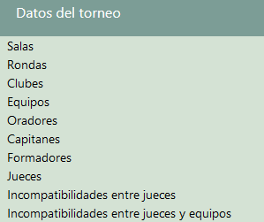
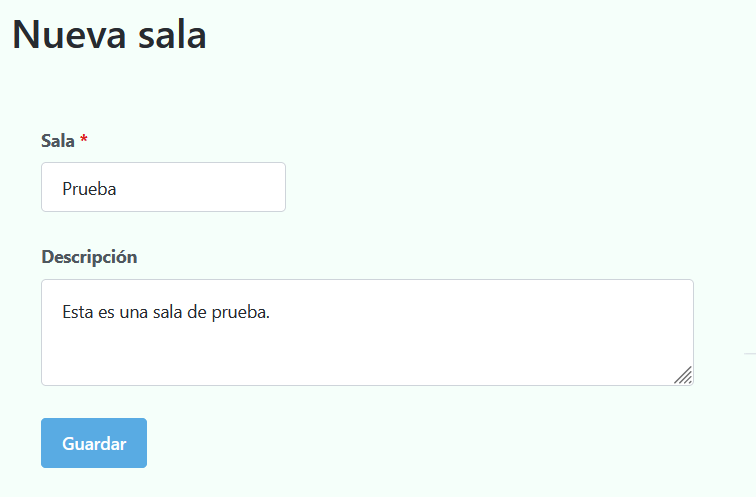
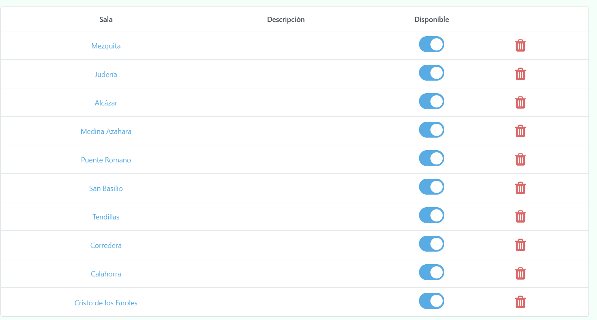
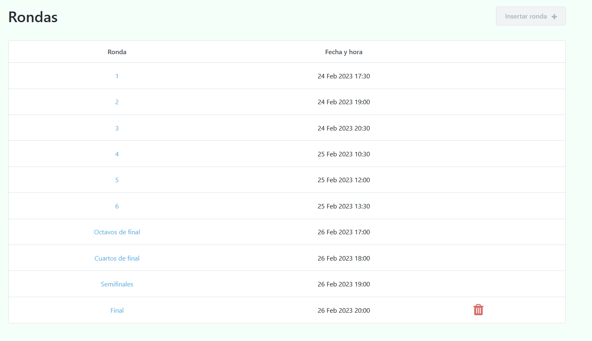
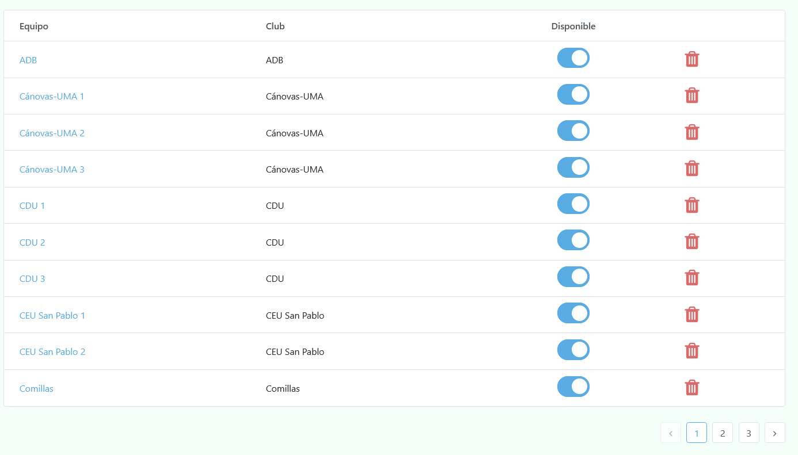
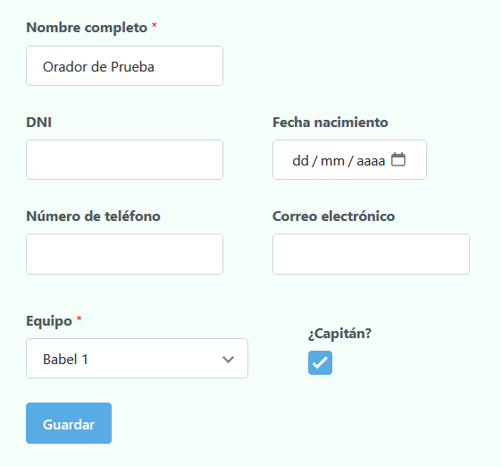
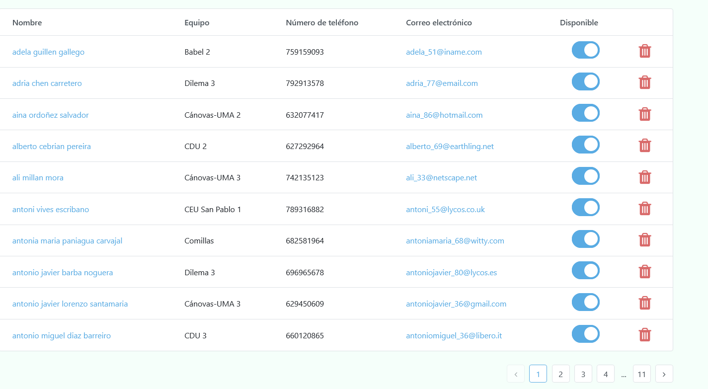
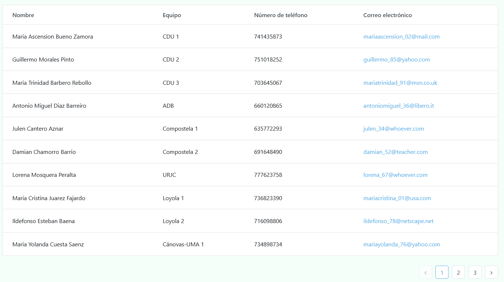
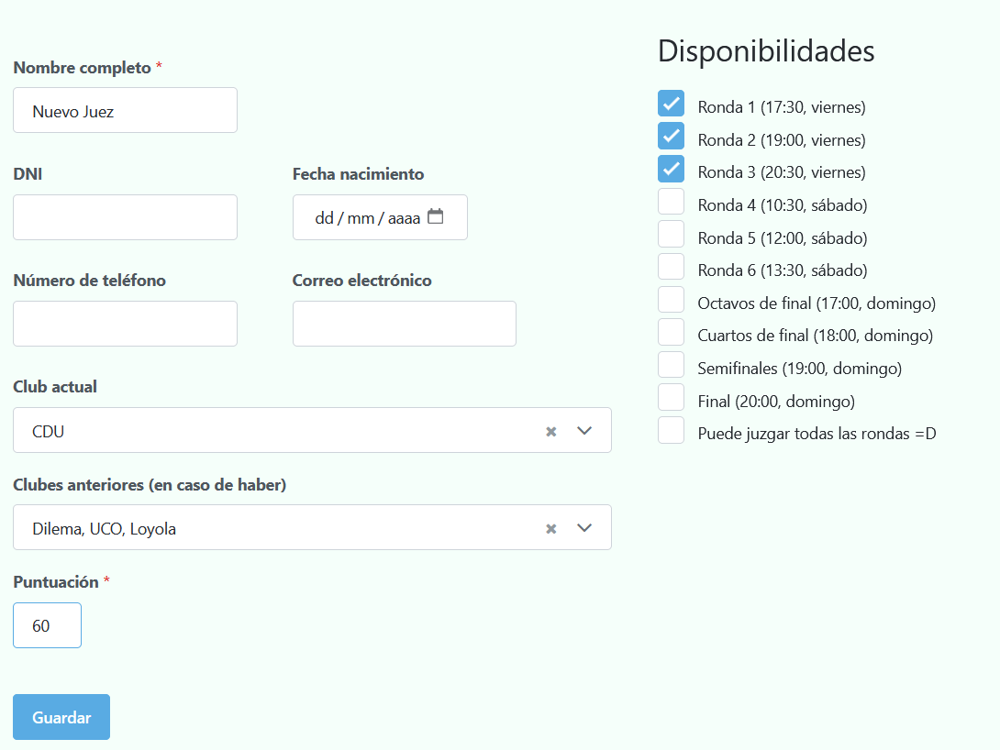

# Datos

Estas son las entidades que han de insertarse para poder comenzar a tabular cualquier torneo:

* Salas

* Rondas

* Clubes

* Equipos

* Oradores

* Capitanes

* Jueces

* Incompatibilidades entre jueces

* Incompatibilidades entre jueces y equipos

💡
Puedes acceder a cada uno de ellas desde la barra lateral, expandiendo datos del torneo.

## Salas 🚪

Estas representan aquellos lugares donde se realizarán los debates. Pueden albergar valores tanto numéricos (1,2,3, ...) como alfanuméricos (Aula 1, Aula 2, ...). La elección de un tipo u otro dependerá de cada torneo en cuestión.

Además, cuentan con un campo `descripción`, el cual permite (en caso de considerarse necesario, ya que no es obligatorio rellenarlo) especificar detalles de la sala en sí (ubicación, accesibilidad a la misma, etc.).

Ejemplo de sala

 

10 primeras salas del torneo de prueba

 

💡
Puedes modificar la disponibilidad de cada sala mediante la última columna.

 

## Rondas 📅

Las cuales incluyen tanto las clasificatorias (1,2,3...) como las finales (octavos, cuartos, semis o final).

Debido a su naturaleza, la forma de insertarlas es de manera secuencial, comenzando con la ronda 1, luego la 2 y así sucesivamente hasta el número de rondas clasificatorias necesarias.

Y con respecto a las rondas finales, simplemente bastará con elegir la primera de ellas (que dependiendo del torneo pueden ser cuartos, semis, etc.) y del mismo modo que con las rondas clasificatorias, se podrá elegir la siguiente sucesivamente.

Ejemplo de un torneo con 6 rondas clasificatorias y 4 rondas finales

 

⚠️

Una vez se haya insertado la ronda final, no será posible introducir más rondas (ya que se presupone que es la última del torneo).

💡
Puedes eliminar una ronda utilizando la papelerita que se encuentra en la última columna, pero ten en cuenta que solo
podrá hacerse con la última de todas (ya que de lo contrario se perdería la secuencia que requiere la inserción de esta
entidad).

## Clubes

Esta entidad muestra todos los clubes presentes en el torneo, incluyendo además cuántos equipos y jueces están adscritos a cada uno de ellos.

10 primeros clubes del torneo de prueba

 

## Equipos

Para registrar a un equipo basta con introducir el nombre del equipo y el club al que pertenece.

Ejemplo de inserción de un nuevo equipo

 

💡
También es posible permitir a los participantes que registren ellos mismos el equipo. Ver Registro de equipos

 

10 primeros equipos del torneo de prueba

 

💡
Como puede apreciarse en la última imagen, es posible cambiar la disponibilidad de cada equipo en todo momento (por defecto estarán todos disponibles hasta que se especifique lo contrario).

 

## Oradores 🗣️

Representan a los integrantes de los diferentes equipos. Por lo tanto, hay que insertar el equipo al que pertenecen (y marcar la casilla de capitán en caso de que el participante en cuestión lo sea).

Ejemplo de orador

 

⚠️

Únicamente el nombre del orador y el equipo de procedencia son obligatorios; el resto de campos pueden rellenarse o no a voluntad de los requisitos del torneo.

 

Ejemplo de oradores

 

💡
Nuevamente se puede cambiar a voluntad la disponibilidad de cada orador.

## Capitanes

Esta entidad, al igual que en el caso de los clubes, no puede ser insertada directamente, ya que únicamente muestra los capitanes de cada uno de los equipos registrados hasta ahora.

Su utilidad radica en que es posible ver directamente la información de contacto de cada capitán, lo cual puede ser especialmente útil por si se desea enviar un **correo al equipo** o se desea crear el clásico **grupo de capitanes** de Whatsapp.

Ejemplo de capitanes

 

## Jueces 🧑🏼‍⚖️

Esta entidad representa a todos los jueces que juzgarán al menos un debate a lo largo de todo el torneo. A continuación se presentarán los 3 principales datos con los que debe contar cada juez (además del nombre y el resto de información opcional similar a los oradores, claro está).

####  Clubes

Es posible indicar el club al que juez pertenece en la actualidad **(club actual)**, además de los clubes en los cuales estuvo en el pasado **(clubes antiguos)** (en caso de haber, claro está). Todo ello para poder controlar las incompatibilidades de tipo club.

#### Disponibilidades

Para que Tabademic sepa con qué jueces cuenta en cada ronda, es necesario que a la hora de insertar un juez, se indice expresamente en qué rondas estará disponible.

Para ello, se cuenta con una serie de checkboxes con cada una de las rondas del torneo **(las cuales deberán estar previamente insertadas, ya que de lo contrario no aparecerá ninguna**).

Ejemplo de disponibilidades

 

💡
Es posible modificar dichas disponibilidades en el futuro, así que no te preocupes si se trata únicamente de algo provisional.

#### Puntuación

Como es bien sabido, cada debate lo juzga un juez principal y (en caso de haber) uno o más jueces secundarios. El criterio para determinar quién será principal o secundario se realiza a través de la puntuación.

Como su nombre indica, sirve para "valorar" (ya que es algo profundamente subjetivo) la calidad del juez. Cuanto más alto, más probable es que dicho juez sea principal en aquellas rondas en las que vaya a estar presente, y viceversa.

💡
No existe un rango mínimo ni máximo para la puntuación, ya que se deja a libre elección del equipo de organización. Aún así, lo recomendable es que este vaya del 1 al 10 ó del 1 al 100 (pudiendo incluir números decimales si se estima oportuno).

Ejemplo de juez

 

## Incompatibilidades

Además de las incompatibilidades entre clubes (ya sean actual como antiguos), es posible especificar dos tipos de incompatibilidades extra:

* Entre jueces

* Entre jueces y equipos

#### Entre jueces

Para añadir este tipo de incompatibilidad, simplemente basta con seleccionar en el primer desplegable el juez en cuestión, y en el segundo la incompatibilidad en sí.

Ejemplo de incompatibilidad entre dos jueces

 

💡
No hay límite en cuanto al número de incompatibilidades que puede tener un mismo juez.

#### Entre jueces y equipos

Similar a la entidad anterior, solo que esta vez el segundo desplegable se refiere al equipo en cuestión.

Ejemplo de incompatibilidad entre un juez y un equipo

 

⚠️

Aunque en el desplegable de equipos aparezcan tanto del club actual como del club antiguo del juez, no es necesario incluirlos ya que Tabademic los tiene directamente en cuenta de manera interna (de ahí el porqué de que cada juez tenga un club asignado).

Una vez vistos todas las entidades, ¡ya es hora de generar los enfrentamientos!