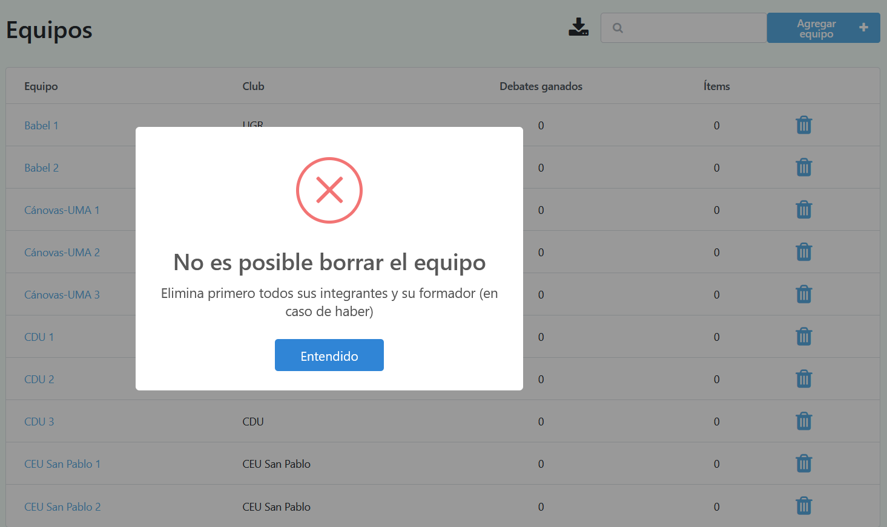

# Manipulando datos

Una vez se ha configurado satisfactoriamente el torneo, se deben insertar todos los datos del mismo. Pero antes, veremos las 4 operaciones que pueden realizarse sobre estos:

* Visualización

* Inserción

* Modificación

* Borrado

## Visualización

Cada vez que le des click a una entidad, aparecerá una tabla con la información insertada hasta ese momento (en caso de no haber datos todavía, solo será visible la primera fila, la cual corresponde al nombre de las columnas).

Dicha tabla solo contiene una porción de los datos. Para ver el resto, simplemente debes darle click a la flecha de la parte inferior derecha (similar a cuando buscas algo en Google), permitiendo así cargar las siguientes filas.

 Ejemplo de las salas del torneo

## Inserción

Para insertar un dato concreto, simplemente debes irte a la página de la entidad (por ejemplo, salas) y después en el botón azul de la esquina superior derecha.

Esto te llevará a un formulario con los datos concretos de la entidad en cuestión (si es una sala, su nombre y una descripción).

Los datos obligatorios aparecerán marcados con un pequeño asterisco rojo, mientras que los opcionales no vendrán acompañados de nada.

Una vez hayas rellenado el formulario, simplemente dale click en "Guardar" para que se efectúen los cambios.

⚠️Ten en cuenta que hay campos que no se pueden repetir, ya que de lo contrario la aplicación no puede diferenciarlos. Por ejemplo, si ya existe una sala denominada 'Sala', no podrás insertar otra llamada igual.

## Modificación

La primera columna de cada entidad siempre aparecerá en color azul. Si le das click, te aparecerá un formulario similar al de inserción, pero con los datos ya rellenados de la entidad que estás tratanto de modificar.

Simplemente cambia lo que consideres, dale click en "Guardar", y los cambios deberían haberse efectuado satisfactoriamente.

⚠️Ten mucho cuidado al modificar debates, ya que si alteras el equipo ganador o los ítems, esto tendrá un impacto directo en la clasificación global del torneo.

## Borrado

La última columna de cada tabla contendrá un icono de una papelerita. Simplemente debes darle click para borrar el elemento deseado.

⚠️

Los datos tienen una jerarquía, de tal manera que no es posible por ejemplo borrar un equipo si sus oradores aún se encuentran insertados.

 
 

En cada caso específico vendrá un mensaje de error advirtiendo el por qué no se ha podido efectuar el borrado.

Ejemplo de error al internar borrar un equipo con sus integrantes aún insertados

## Entidades

Estas son las entidades con las que actualmente cuenta Tabademic:

* Salas

* Rondas

* Clubes

* Equipos

* Oradores

* Capitanes

* Formadores

* Jueces

* Incompatibilidades entre jueces

* Incompatibilidades entre jueces y equipos

💡
Puedes acceder a cada uno de ellos desde la barra lateral, expandiendo datos del torneo.

#### Salas

Estas representan aquellos lugares donde se realizarán los debates. Pueden albergar valores tanto numéricos (1,2,3, ...) como alfanuméricos (Aula 1, Aula 2, ...). La elección de un tipo u otro dependerá de cada torneo en cuestión.

Además, cuentan con un campo `descripción`, el cual permite (en caso de considerarse necesario, ya que no es obligatorio rellenarlo) especificar detalles de la sala en sí (ubicación, accesibilidad a la misma, etc.).

![Ejemplo de sala]