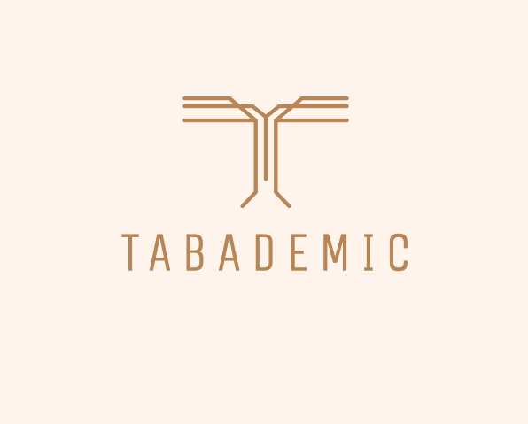

# Manual de usuario de Tabademic

Tabademic es un software de tabulación **enfocado exclusivamente en debate académico**, cuya principal finalidad es la de facilitar en la mayor medida de lo posible la tabulación de este tipo de competiciones.

Para ello cuenta (entre otras muchas cosas) con las siguientes funcionalidades:

* Almacenar todo tipo de información (equipos, oradores, jueces, debates...)

* Generar enfrentamientos (suizo o sistema todos contra todos)

* Asignación automática de jueces teniendo en cuenta todo tipo de incompatibilidades (permitiendo su posterior modificación manual)

* Calcular la clasificación en tiempo real de los equipos y las menciones de los oradores