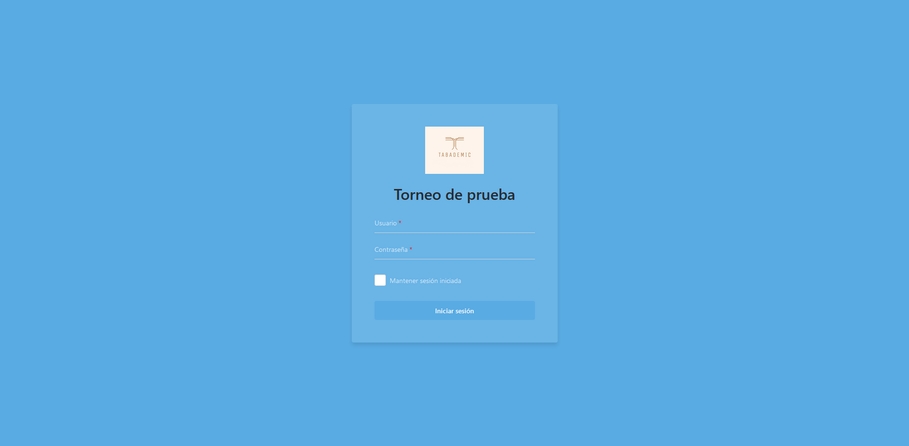
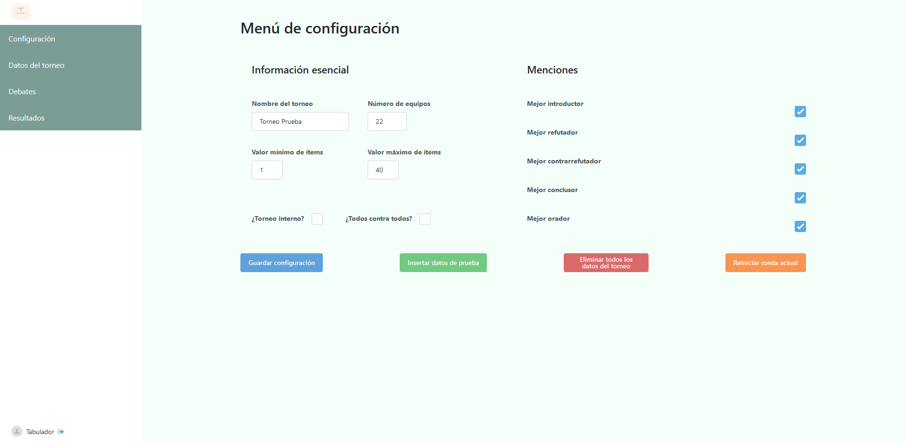

<link href="styles.css" rel="stylesheet"></link>

# Primeros pasos

## Solicitar la creación del torneo

Tabademic no require de ningún tipo de instalación, ya que toda su funcionalidad se encuentra disponible **en la web**. Sin embargo, cada torneo debe
de ser creado de antemano por el desarrollador del programa. Sus datos de contacto los puedes encontrar en la sección **autor**.

Una vez creado el torneo, recibirás la URL del torneo, un usuario y una contraseña, con los que podrás comenzar a utilizar Tabademic sin ningún tipo de conocimientos técnicos.

 

⚠️El usuario previamente mencionado tiene rol de tabulador , el cual tiene acceso de lectura/escritura a absolutamente todos los datos del torneo.
Asegúrate por favor de no compartir la contraseña con nadie. En caso de una brecha de seguridad, contacta inmediatamente con el desarollador.

## Iniciar sesión

Una vez le des click a la URL del torneo, aparecerá la siguiente página de login.

Simplemente debes iniciar sesión con el usuario y contraseña obtenidos en el paso anterior. Después de ello, serás redirigido a la página de configuración.

## Configurar el torneo

Tabademic cuenta con diversas opciones de configuración, de tal forma que pueda adaptarse a diferentes tipos de torneos.

En ella, podremos configurar los siguientes aspectos del torneo:

* El nombre

* El número de equipos

* Valor mínimo y máximo de ítems

* Qué menciones de oradores se tendrán en cuenta

* ¿Es un torneo interno?

* ¿Es un sistema todos contra todos?

Además, en la parte inferior de la página se encuentran los siguientes botones:

* **Guardar cambios** -> Guarda la configuración.

* **Insertar datos de prueba** --> Pensada para jugar con la aplicación sin tener que haber insertado previamente los datos reales del torneo.

* **Eliminar todos los datos del torneo** --> Muy útil queremos eliminar los datos de prueba y comenzar a insertar datos reales.

* **Reiniciar ronda actual** --> Elimina todos los debates de la ronda actual y decrece en 1 la ronda actual. Suele emplearse en caso de que se haya generado una ronda de manera incorrecta, de tal forma que se pueda generar nuevamente.

 

⚠️Pulsar en reitaradas ocasiones el botón de reiniciar ronda actual hará que se vayan eliminando una ronda tras otra del torneo. Utilizar con sumo cuidado.

