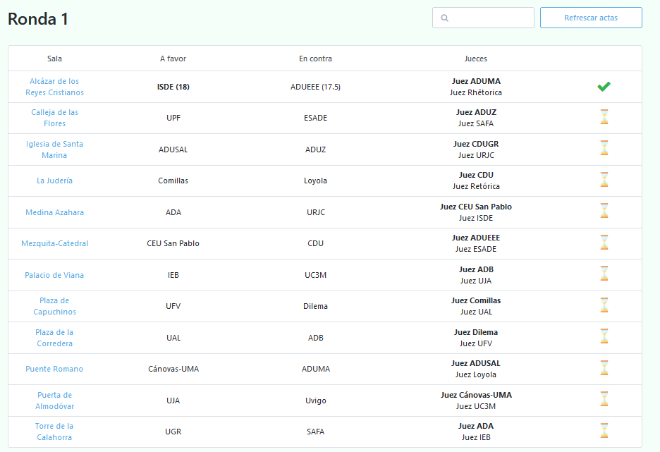
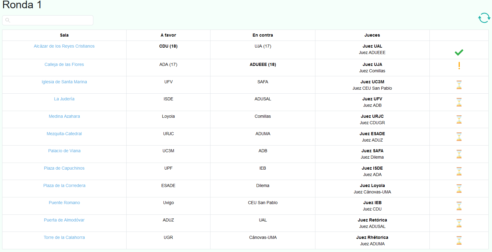
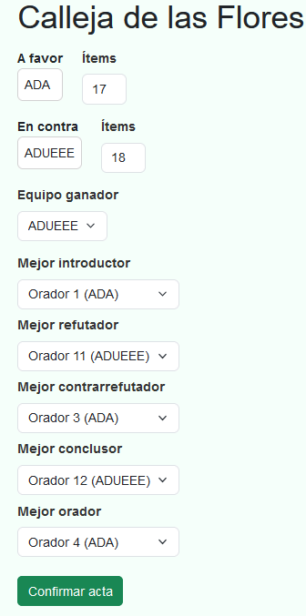

# Actas de la ronda actual

Una vez generados los enfrentamientos, serás redirigido a `Actas de la ronda actual`, donde encontrarás una tabla
con todas las actas correspondientes a cada debate.

Actas de la primera ronda

 

💡
La última columna contiene el estatus del acta (en este caso aparece un reloj de arena porque los debates aún están en curso).

Ahora es el turno de relajarnos y esperar a que los debates terminen. Una vez nos comuniquen que los jueces ya están deliberando, será el momento de insertar las actas.

Como veremos a continuación, podemos insertarlas nosotros mismos o que los jueces sean quienes las envíen y nosotros simplemente las confirmemos.

## Inserción directa

Para insertar un acta, simplemente debes darle click a su respectiva sala y rellenar los datos correspondientes.

Acta de la primera sala

 

⚠️ Debido a que cada torneo tiene su propia acta física, la digital incluye únicamente los resultados derivados de esta. Por lo tanto, en caso de que sean los jueces quienes envíen las actas digitales y veas alguna disparidad,  guíate siempre por la hoja de ítems.

 

Una vez hayas rellenado el acta, su estatus cambiará a **confirmada**.

 

💡
Si necesitas cambiar algún valor de un acta ya insertada, simplemente vuelve a entrar en ella y haz los cambios respectivos

## Inserción a través de los jueces

Como ya se mencionó anteriormente, los jueces cuentan con una URL privada que les permite enviar actas.

El proceso es muy simple, solo deben abrir su URL privada y darle click en `Insertar acta`. Una vez hecho eso, se les cargará el acta correspondiente al debate que están juzgando (similar al mostrado hace un momento).

Acta de la segunda sala insertada por un juez (vista móvil)

 

⚠️ El acta digital solo se puede enviar una única vez. Por lo tanto, con que uno de los jueces la envíe es suficiente.

Una vez enviada, su estatus cambiará a un signo de exclamación, indicando que el acta ha sido enviada, pero necesita una revisión por parte de tabulación (es decir, confirmarla).

 

 

### Confirmación de actas

Simplemente debemos darle click a la sala del acta que deseamos confirmar. Una vez hecho esto, veremos los diferentes formularios los datos rellenados por el juez.

Una vez hayamos comprobado que coincide con la acta física, bastará con presionar el botón de `confirmar acta`.

 

Acta anterior preparada para ser confirmada

 

Habiendo hecho esto, podremos observar cómo la acta de dicho debate ya se encuentra confirmada.

 

💡
Para no tener que estar recargando la página continuamente una vez los jueces estén enviando las actas, es posible refrescar las mismas mediante el icono en la parte superior derecha.

Una vez hayan sido **enviadas y confirmadas** todas las actas de la ronda actual, será posible generar los enfrentamientos de la siguiente ronda.