# Datos

Estas son las entidades que han de insertarse para poder comenzar a tabular cualquier torneo:

* Rondas

* Salas

* Clubes (los cuales se insertan automáticamente como se verá más adelante)

* Equipos

* Oradores

* Jueces

* Incompatibilidades entre jueces (en caso de haber)

* Incompatibilidades entre jueces y equipos (en caso de haber)

💡
Puedes acceder a cada uno de ellas desde la barra lateral, expandiendo datos del torneo.

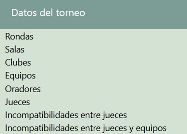

## Rondas 📅

Las cuales incluyen tanto las clasificatorias (1,2,3...) como las finales (octavos, cuartos, semis o final).

Debido a su naturaleza, la forma de insertarlas es de manera secuencial, comenzando con la ronda 1, luego la 2 y así sucesivamente hasta el número de rondas clasificatorias necesarias.

Y con respecto a las rondas finales, simplemente bastará con elegir la primera de ellas (que dependiendo del torneo pueden ser cuartos, semis, etc.) y del mismo modo que con las rondas clasificatorias, se podrá elegir la siguiente sucesivamente.

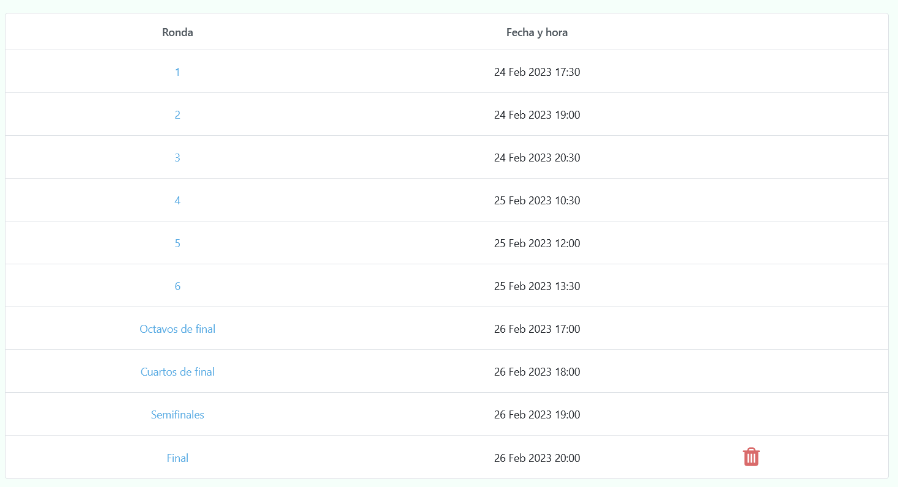

Ejemplo de un torneo con 6 rondas clasificatorias y 4 rondas finales

 

⚠️ Una vez se haya insertado la ronda final, no será posible introducir más rondas (ya que se presupone que es la última del torneo).

💡
Puedes eliminar una ronda utilizando la papelerita que se encuentra en la última columna, pero ten en cuenta que solo
podrá hacerse con la última de todas (ya que de lo contrario se perdería la secuencia que requiere la inserción de esta
entidad).

## Salas 🚪

Estas representan aquellos lugares donde se realizarán los debates. Pueden albergar valores tanto numéricos (1,2,3, ...) como alfanuméricos (Aula 1, Aula 2, ...). La elección de un tipo u otro dependerá de cada torneo en cuestión.

Además, cuentan con un campo `descripción`, el cual permite (en caso de considerarse necesario, ya que no es obligatorio rellenarlo) especificar detalles de la sala en sí (ubicación, accesibilidad a la misma, etc.).

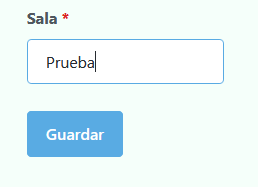

Ejemplo de sala

 

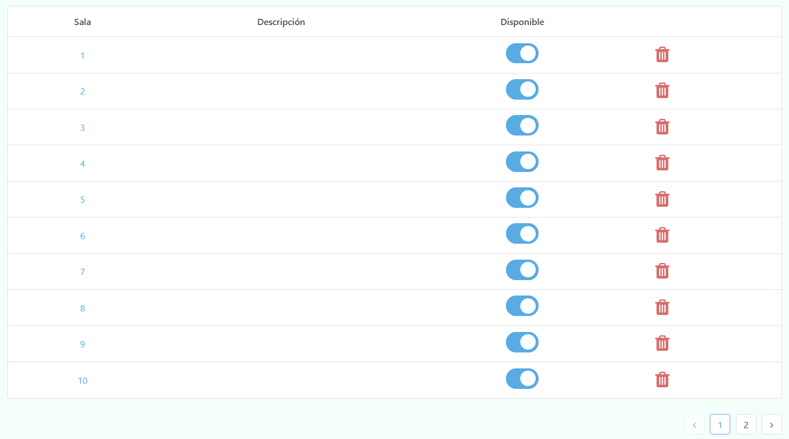

10 primeras salas del torneo de prueba

 

💡
Puedes modificar la disponibilidad de cada sala mediante la penúltima columna.

 

## Clubes

Esta entidad muestra todos los clubes presentes en el torneo, incluyendo además cuántos equipos y jueces pertenecen a cada uno de ellos.

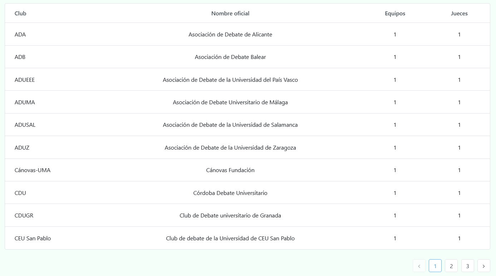

10 primeros clubes del torneo de prueba

 

## Equipos

Para insertar un equipo basta con introducir el nombre del equipo y el club al que pertenece.

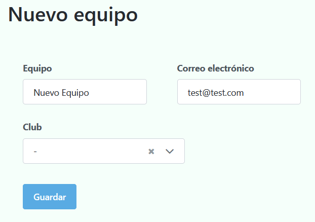

Ejemplo de inserción de un nuevo equipo

 

💡
Cada vez que se inserta un nuevo equipo, Tabademic le asigna automáticamente una URL privada, la cual le permite
enviar feedbacks a los diferentes jueces principales que lo hayan juzgado  (únicamente en las rondas clasificatorias).

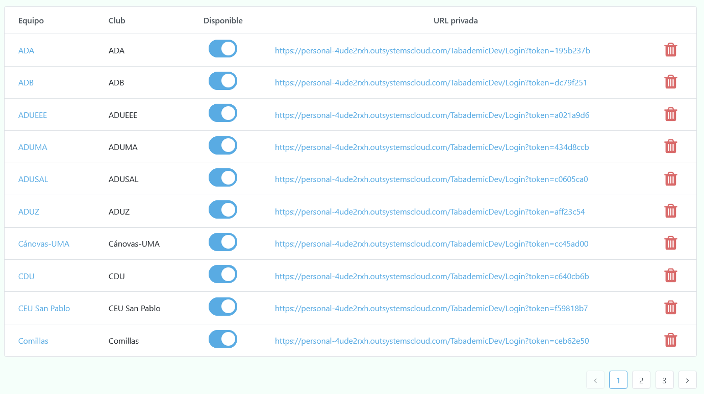

10 primeros equipos del torneo de prueba

 

💡
Como puede apreciarse en la última imagen, es posible cambiar la disponibilidad de cada equipo en todo momento (por defecto estarán todos disponibles hasta que se especifique lo contrario).

 

### Lista de clubes

Estos son los clubes que soporta actualmente Tabademic (**si necesitas incluir alguno, contacta por favor con el desarrollador**):

<table class="table table-bordered table-hover table-condensed">
<thead><tr><th title="Club">Club</th>
<th title="Nombre oficial">Nombre oficial</th>
</tr></thead>
<tbody><tr>
<td>ADA</td>
<td>Asociación de Debate de Alicante</td>
</tr>
<tr>
<td>ADB</td>
<td>Asociación de Debate Balear</td>
</tr>
<tr>
<td>ADUEEE</td>
<td>Asociación de Debate de la Universidad del País Vasco</td>
</tr>
<tr>
<td>ADUMA</td>
<td>Asociación de Debate Universitario de Málaga</td>
</tr>
<tr>
<td>ADUSAL</td>
<td>Asociación de Debate de la Universidad de Salamanca</td>
</tr>
<tr>
<td>ADUZ</td>
<td>Asociación de Debate de la Universidad de Zaragoza</td>
</tr>
<tr>
<td>Abat Oliba CEU</td>
<td>Club de Debate de la Universidad Abat Oliba CEU</td>
</tr>
<tr>
<td>Aldovea</td>
<td>Colegio de Fomento Aldovea</td>
</tr>
<tr>
<td>Brains</td>
<td>Brains International School</td>
</tr>
<tr>
<td>CDA</td>
<td>Club de Debate de Asturias</td>
</tr>
<tr>
<td>CDC</td>
<td>Club Debate Compostela</td>
</tr>
<tr>
<td>CDU</td>
<td>Córdoba Debate Universitario</td>
</tr>
<tr>
<td>CDUA</td>
<td>Club de Debate de la Universidad de Alicante</td>
</tr>
<tr>
<td>CDUGR</td>
<td>Club de Debate Universitario de Granada</td>
</tr>
<tr>
<td>CEU Cardenal Herrera</td>
<td>Club de Debate de la Universidad de CEU Cardenal Herrera</td>
</tr>
<tr>
<td>CEU San Pablo</td>
<td>Club de Debate de la Universidad CEU San Pablo</td>
</tr>
<tr>
<td>CMU Alcalá</td>
<td>Colegio Mayor Universitario Alcalá</td>
</tr>
<tr>
<td>CMU Alcor</td>
<td>Colegio Mayor Universitario Alcor</td>
</tr>
<tr>
<td>CMU Antonio de Nebrija</td>
<td>Colegio Mayor Universitario Antonio de Nebrija</td>
</tr>
<tr>
<td>CMU Antonio de Nebrija</td>
<td>Colegio Mayor Universitario Antonio de Nebrija</td>
</tr>
<tr>
<td>CMU Aquinas-Roncalli</td>
<td>Colegio Mayor Universitario Aquinas-Roncalli</td>
</tr>
<tr>
<td>CMU Berrospe</td>
<td>Colegio Mayor Universitario Berrospe</td>
</tr>
<tr>
<td>CMU Elías-Ahúja</td>
<td>Colegio Mayor Universitario Elías-Ahúja</td>
</tr>
<tr>
<td>CMU Fundación SEPI</td>
<td>Colegio Mayor Universitario Fundación SEPI</td>
</tr>
<tr>
<td>CMU Isabel de España</td>
<td>Colegio Mayor Universitario Isabel de España</td>
</tr>
<tr>
<td>CMU Jaime del Amo</td>
<td>Colegio Mayor Universitario Jaime del Amo</td>
</tr>
<tr>
<td>CMU Jaime-Vedruna</td>
<td>Colegio Mayor Universitario Jaime-Vedruna</td>
</tr>
<tr>
<td>CMU Juan Luis Vives</td>
<td>Colegio Mayor Universitario Juan Luis Vives</td>
</tr>
<tr>
<td>CMU Loyola</td>
<td>Colegio Mayor Universitario Loyola</td>
</tr>
<tr>
<td>CMU Mara</td>
<td>Colegio Mayor Universitario Mara</td>
</tr>
<tr>
<td>CMU Mendel</td>
<td>Colegio Mayor Universitario Mendel</td>
</tr>
<tr>
<td>CMU Moncloa</td>
<td>Colegio Mayor Universitario Moncloa</td>
</tr>
<tr>
<td>CMU Nuestra Señora de Guadalupe</td>
<td>Colegio Mayor Universitario Nuestra Señora de Guadalupe</td>
</tr>
<tr>
<td>CMU Nuestra Señora de África</td>
<td>Colegio Mayor Universitario Nuestra Señora de África</td>
</tr>
<tr>
<td>CMU Pino</td>
<td>Colegio Mayor Universitario Pino</td>
</tr>
<tr>
<td>CMU Pío XII</td>
<td>Colegio Mayor Universitario Pío XII</td>
</tr>
<tr>
<td>CMU San Agustín</td>
<td>Colegio Mayor Universitario San Agustín</td>
</tr>
<tr>
<td>CMU San Pablo</td>
<td>Colegio Mayor Universitario San Pablo</td>
</tr>
<tr>
<td>CMU Santa María de Europa</td>
<td>Colegio Mayor Universitario Santa María de Europa</td>
</tr>
<tr>
<td>CMU Vedruna</td>
<td>Colegio Mayor Universitario Vedruna</td>
</tr>
<tr>
<td>Comillas</td>
<td>Club de Debate de la Universidad Pontificia Comillas</td>
</tr>
<tr>
<td>Cánovas-UMA</td>
<td>Cánovas Fundación</td>
</tr>
<tr>
<td>Debate Innova</td>
<td>Asociación de Debate y oratoria Innova</td>
</tr>
<tr>
<td>Deusto</td>
<td>Club de Debate de la Universidad de Deusto</td>
</tr>
<tr>
<td>Dikaios</td>
<td>Club de Debate de la Universidad de Navarra</td>
</tr>
<tr>
<td>Dilema</td>
<td>Asociación de Debate Dilema</td>
</tr>
<tr>
<td>ESADE</td>
<td>Sociedad de Debate de ESADE</td>
</tr>
<tr>
<td>El Pradro</td>
<td>Colegio de Fomento El Prado</td>
</tr>
<tr>
<td>Esclavas Chamberí</td>
<td>Colegio Esclavas Chamberí</td>
</tr>
<tr>
<td>GAD-UAB</td>
<td>Grup d&#39;Argumentació i Debat de la Universitat Autònoma de Barcelona</td>
</tr>
<tr>
<td>IEB</td>
<td>Instituto de Estudios Bursátiles</td>
</tr>
<tr>
<td>IQS</td>
<td>Club de Debate del Instituto Químico de Sarrià</td>
</tr>
<tr>
<td>ISDE</td>
<td>Instituto Superior de Derecho y Economía</td>
</tr>
<tr>
<td>La Salle Maravillas</td>
<td>Colegio La Salle Maravillas</td>
</tr>
<tr>
<td>Las Rozas</td>
<td>IES Las Rozas</td>
</tr>
<tr>
<td>Lope de Vega</td>
<td>Lope de Vega International School</td>
</tr>
<tr>
<td>Loyola</td>
<td>Club de Debate de la Universidad Loyola Andalucía</td>
</tr>
<tr>
<td>Montpellier</td>
<td>Colegio Montpellier</td>
</tr>
<tr>
<td>Nebrija</td>
<td>Club de Debate de la Universidad de Nebrija</td>
</tr>
<tr>
<td>Nuestra Señora del Recuerdo</td>
<td>Colegio Nuestra Señora del Recuerdo</td>
</tr>
<tr>
<td>Retórica</td>
<td>Asociación de Debate Retórica</td>
</tr>
<tr>
<td>Rhētorica</td>
<td>Club de Debat acadèmic i oratòria de la Universitat Pompeu Fabra</td>
</tr>
<tr>
<td>SAFA</td>
<td>Asociación de Debate Universitario SAFA</td>
</tr>
<tr>
<td>SEK Ciudalcampo</td>
<td>Colegio Internacional SEK-Ciudalcampo</td>
</tr>
<tr>
<td>Santa Gema Galgani</td>
<td>Colegio Santa Gema Galgani</td>
</tr>
<tr>
<td>UAH</td>
<td>Aula de Debate y Oratoria UAH</td>
</tr>
<tr>
<td>UAL</td>
<td>Asociación Juvenil de Debate Universitario de la Universidad de Almería</td>
</tr>
<tr>
<td>UAM</td>
<td>Sociedad de Debate de la Universidad Autónoma de Madrid</td>
</tr>
<tr>
<td>UB</td>
<td>Associació de Debat de la Universitat de Barcelona</td>
</tr>
<tr>
<td>UC</td>
<td>Club de Debate de la Universidad de Cantabria</td>
</tr>
<tr>
<td>UC3M</td>
<td>Sociedad de Debate UC3M</td>
</tr>
<tr>
<td>UCA</td>
<td>Club de Debate de la Universidad de Cádiz</td>
</tr>
<tr>
<td>UCAM</td>
<td>Club de Debate de la Universidad Católica San Antonio de Murcia</td>
</tr>
<tr>
<td>UCJC</td>
<td>Club de Debate y Oratoria UCJC</td>
</tr>
<tr>
<td>UCLM</td>
<td>Club de Debate de la Universidad de Castilla-La Mancha</td>
</tr>
<tr>
<td>UCM-COM</td>
<td>Sociedad de Debate Complutense</td>
</tr>
<tr>
<td>UCM-SDC</td>
<td>Universidad Complutense de Madrid - Comunícate</td>
</tr>
<tr>
<td>UCO</td>
<td>Aula de Debate de Córdoba</td>
</tr>
<tr>
<td>UEMC</td>
<td>Club de Debate de la Universidad Europea Miguel de Cervantes</td>
</tr>
<tr>
<td>UEX</td>
<td>Aula de Debate de la Universidad de Extremadura</td>
</tr>
<tr>
<td>UFV</td>
<td>Sociedad de Debates de la Universidad Francisco de Vitoria</td>
</tr>
<tr>
<td>UHU</td>
<td>Club de Debate de la Universidad de Huelva</td>
</tr>
<tr>
<td>UJA</td>
<td>Aula de Debate de la Universidad de Jaén</td>
</tr>
<tr>
<td>UJI</td>
<td>Club de Debate de la Universidad Jaime I</td>
</tr>
<tr>
<td>ULL</td>
<td>Club de Debate de la Universidad de la Laguna</td>
</tr>
<tr>
<td>ULPGC</td>
<td>Club de Debate de la Universidad de las Palmas de Gran Canaria</td>
</tr>
<tr>
<td>UM</td>
<td>Club de Debate de la Universidad de Murcia</td>
</tr>
<tr>
<td>UMA</td>
<td>Aula de Debate de la Universidad de Málaga</td>
</tr>
<tr>
<td>UMH</td>
<td>Club de Debate de la Universidad de Miguel Hernández de Elche</td>
</tr>
<tr>
<td>UNAM</td>
<td>Club de Debate de la Universidad del Atlántico Medio</td>
</tr>
<tr>
<td>UNED</td>
<td>Club de Debate de la Universidad Nacional a Distancia</td>
</tr>
<tr>
<td>UO</td>
<td>Club de Debate de la Universidad de Oviedo</td>
</tr>
<tr>
<td>UOC</td>
<td>Club de Debate de la Universitat Oberta de Catalunya</td>
</tr>
<tr>
<td>UPF</td>
<td>Club de Debate de la Universidad Pompeu Fabra</td>
</tr>
<tr>
<td>UPM</td>
<td>Club de Debate de la Universidad Politécnica de Madrid</td>
</tr>
<tr>
<td>UPNA</td>
<td>Club de Debate de la Universidad Pública de Navarra</td>
</tr>
<tr>
<td>UPO</td>
<td>Club de Debate de la Universidad Pablo de Olavide</td>
</tr>
<tr>
<td>UPV</td>
<td>Club de Debate de la Universitat Politècnica de València</td>
</tr>
<tr>
<td>UR</td>
<td>Club de Debate de la Universitad de la Rioja</td>
</tr>
<tr>
<td>URJC</td>
<td>Club de Debate de la Universidad Rey Juan Carlos</td>
</tr>
<tr>
<td>URL</td>
<td>Club de Debate de la Universidad Ramon Llull</td>
</tr>
<tr>
<td>URV</td>
<td>Aula de Debate de la Universitat Rovira i Virgili</td>
</tr>
<tr>
<td>US</td>
<td>Club de Debate de la Universidad de Sevilla</td>
</tr>
<tr>
<td>USJ</td>
<td>Club de Debate de la Universidad San Jorge</td>
</tr>
<tr>
<td>UV</td>
<td>Club de Debate de la Universidad de Valencia</td>
</tr>
<tr>
<td>UVic</td>
<td>Club de Debate de la Universidad Central de Cataluña</td>
</tr>
<tr>
<td>UZ</td>
<td>Club de Debate de la Universidad de Zaragoza</td>
</tr>
<tr>
<td>UdG</td>
<td>Club de Debate de la Universitat de Girona</td>
</tr>
<tr>
<td>UdL</td>
<td>Centro de Debate Universitario de la Universidad de Lleida</td>
</tr>
</tbody></table>

 

## Oradores 🗣️

Representan a los participantes del torneo. Por lo tanto, hay que insertar tanto su nombre como el equipo al que pertenecen.

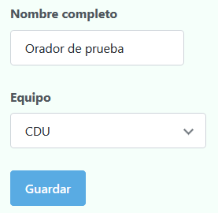

Ejemplo de orador

 

 

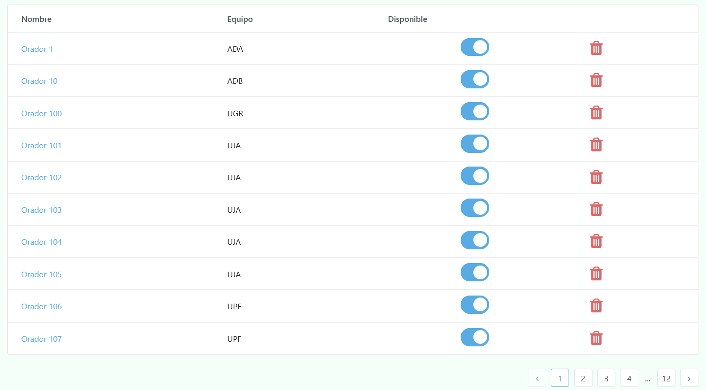

Ejemplo de oradores

 

💡
Del mismo modo que con los equipos, es posible cambiar la disponibilidad de cada orador.

## Jueces 🧑🏼‍⚖️

Esta entidad representa a todos los jueces que juzgarán al menos un debate a lo largo de todo el torneo. A continuación se presentarán los 3 principales datos con los que debe contar cada juez (además de su nombre, claro está).

###  Clubes

Es posible indicar el club al que juez pertenece en la actualidad **(club actual)**, además de los clubes en los cuales estuvo en el pasado **(clubes antiguos)** (en caso de haber, claro está). Todo ello para poder controlar las incompatibilidades de tipo club.

### Disponibilidades

Para que Tabademic sepa con qué jueces cuenta en cada ronda, es necesario que a la hora de insertar un juez, se indice expresamente en qué rondas estará disponible.

Para ello, se cuenta con una serie de checkboxes con cada una de las rondas del torneo **(las cuales deberán estar previamente insertadas, ya que de lo contrario no aparecerá ninguna**).

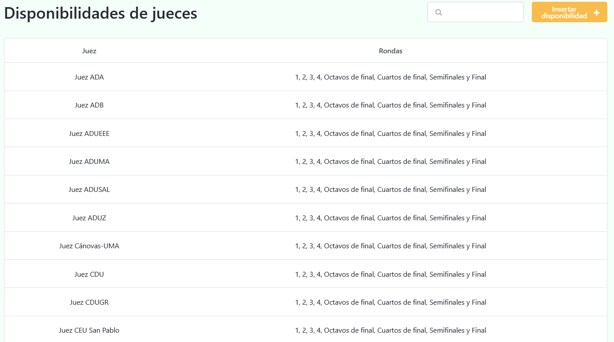

Ejemplo de disponibilidades

 

💡
Es posible modificar dichas disponibilidades en el futuro, así que no te preocupes si se trata únicamente de algo provisional.

### Puntuación

Como es bien sabido, cada debate lo juzga un juez principal y (en caso de haber) uno o más jueces secundarios. El criterio para determinar quién será principal o secundario se realiza a través de la puntuación, la cual se representa con un entero positivo.

Como su nombre indica, sirve para "valorar" (ya que es algo profundamente subjetivo) la calidad del juez. Cuanto más alto, más probable es que dicho juez sea principal en aquellas rondas en las que vaya a estar presente, y viceversa.

💡
No existe un rango mínimo (obviando el 1) ni máximo para la puntuación, ya que se deja a libre elección del equipo de organización. Aún así, lo recomendable es que este vaya del  1 al 100 para tener un buen rango de valores.

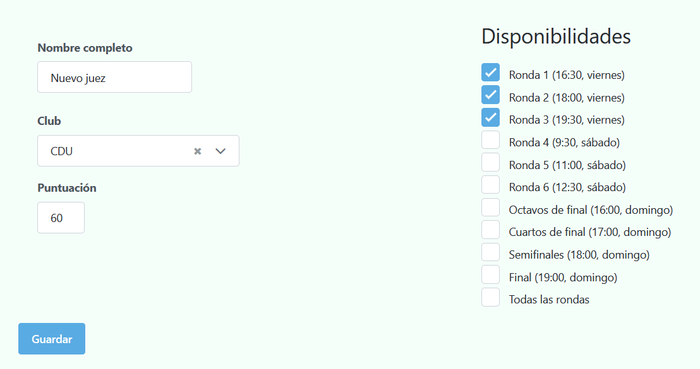

Ejemplo de juez

 

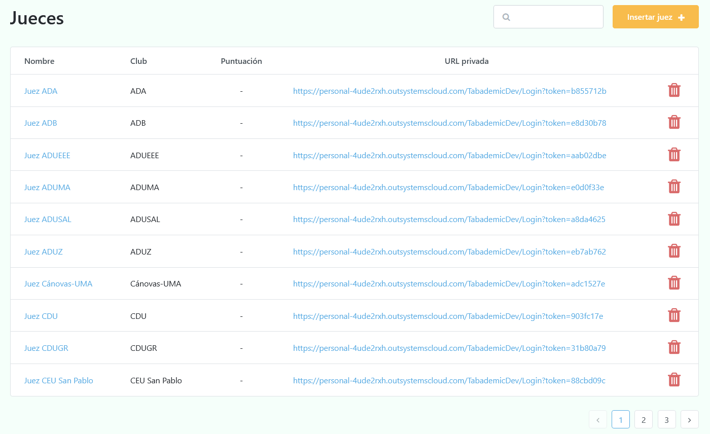

10 primeros jueces del torneo de prueba

 

💡Como se puede apreciar en la imagen, cada juez presenta también una URL privada.
Esta le permitirá modificar sus disponibilidades, rellenar las actas de los debates que le corresponda juzgar a lo largo del torneo y también enviar feedbacks a los jueces con los que haya deliberado.

## Incompatibilidades

Además de las incompatibilidades entre clubes (ya sea el actual o los antiguos), es posible especificar dos tipos de incompatibilidades extra:

* Entre jueces

* Entre jueces y equipos

### Entre jueces

Para incluir este tipo de incompatibilidad, simplemente basta con seleccionar en el primer desplegable el juez en cuestión, y en el segundo la incompatibilidad en sí.

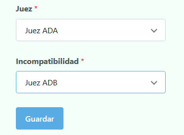

Ejemplo de incompatibilidad entre dos jueces

 

💡
No hay límite en cuanto al número de incompatibilidades que puede tener un mismo juez.

### Entre jueces y equipos

Similar a la entidad anterior, solo que esta vez el segundo desplegable se refiere al equipo en cuestión.

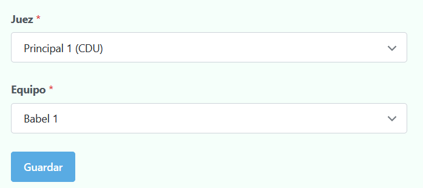

Ejemplo de incompatibilidad entre un juez y un equipo

 

⚠️ Aunque en el desplegable de equipos aparezcan tanto del club actual como del club antiguo del juez, no es necesario incluirlos, ya que Tabademic los tiene directamente en cuenta de manera interna (de ahí el porqué de que cada juez tenga un club asignado).

## Importar datos

Existe una forma más rápida y cómoda de insertar los datos en la aplicación, la cual no requiere ir insertando entidad a entidad.

Navegando a `Importar datos`, será posible:

* Importar equipos con sus respectivos integrantes

* Importar jueces

* Insertar datos de prueba

### Importar equipos

Para ello necesitas disponer de un fichero éxcel con las siguientes columnas:

* Nombre del equipo
* Club al que pertenece
* Primer integrante
* Segundo integrante
* Tercer integrante
* Cuarto Integrante
* Quinto integrante

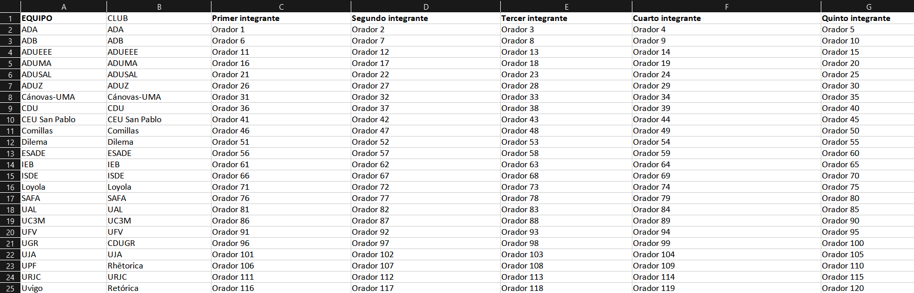

Ejemplo de éxcel con 20 equipos de 5 integrantes cada uno

 

💡El nombre de las columnas no es importante, únicamente su orden.

Una vez subido el fichero, simplemente habrá que darle click al botón de importar equipos y oradores.

⚠️ Tabademic comprueba que no haya ningún equipo repetido y que todos los clubes se encuentren en la [lista de clubes](#lista-de-clubes).

### Importar jueces

Del mismo modo que antes, podemos importar los jueces del torneo mediante otro fichero éxcel. En este caso, las columnas que debe contener son las siguientes:

* Nombre del juez

* Club actual al que pertenece

* Puntuación

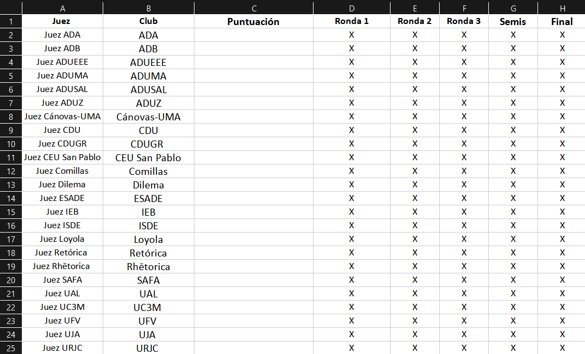

Ejemplo de éxcel con 30 jueces

 

⚠️ También se comprueba que que todos los clubes se encuentren en la [lista de clubes](#lista-de-clubes), además de que no haya dos jueces con el mismo nombre.

💡Recuerda asignarle las disponibilidades a cada juez una vez los hayas importado.

### Insertar datos de prueba

Dándole click al botón del mismo nombre, será posible simular un torneo completo, para que puedas probar la aplicación inmediatamente y sentirte familiarizado con ella antes de insertar datos reales.