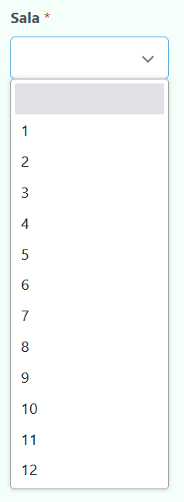

# Cómo insertar los debates de cada ronda

Existen dos formas, de manera directa o a través de los jueces.

## Inserción directa

Esta es la opción recomendada en caso de que no se desee crear cuentas para los jueces y pedirles a estos que inserten sus respectivos debates. Simplemente hay que dirigirse a la página `actas` y darle click a "Insertar acta".

Una vez hecho esto, y después de esperar unos segundos, aparecerá un desplegable con todas las salas donde se han realizado los debates de la ronda actual. (la cual se encarga de obtener los equipos a debatir en función de la sala especificada).

 Ejemplo de desplegable 

 

⚠️ El **desplegable** contiene únicamente las salas de aquellos debates que **aún no han sido insertados**. Por tanto, esta será cada vez menor a medida que insertas actas, hasta que se encuentre vacía y el programa automáticamente te redirija a la generación de los enfrentamientos de la siguiente ronda

