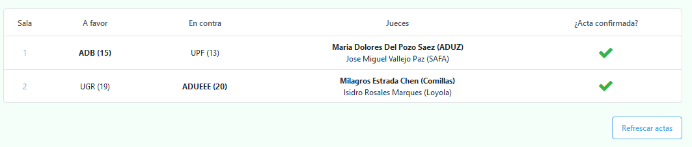

# Cómo insertar los debates de cada ronda

Existen dos formas: de manera directa o a través de los jueces.

## Inserción directa

Esta es la opción recomendada en caso de que no se desee que los jueces rellenen ellos mismos las actas.

Para empezar, simplemente hay que dirigirse a la página `Actas de la ronda actual` y darle click a `Insertar acta`.

Una vez hecho esto, y después de esperar unos segundos, aparecerá un desplegable con todas las salas de los enfrentamientos de la ronda actual.

 Ejemplo de desplegable 

 

⚠️ El **desplegable** contiene únicamente las salas de aquellos debates que **aún no han sido insertados**. Por tanto, esta será cada vez menor a medida que insertas actas, hasta que se encuentre vacía y el programa automáticamente te redirija a la generación de los enfrentamientos de la siguiente ronda

Una vez selecciones una sala, se cargarán los datos asociada a esta:

* Equipos a favor y en contra

* Juez principal y secundarios (en caso de haber)

* Oradores de ambos equipos

Ahora lo único que resta es rellenar los diferentes formularios en base a la hoja de ítems de cada sala.

Acta de la primera sala

 

⚠️ Como se puede apreciar, el acta no es una réplica de la hoja de ítems, sino que se deriva de esta. Por lo tanto, en caso de que sean los jueces quienes envíen las actas digitales y veas alguna disparidad,  guíate siempre por lo que ponga la hoja de ítems.

 

💡
Si te has equivocado de sala, siempre puedes volver a seleccionar otra utilizando el desplegable.

 

💡
Las menciones son opcionales, de tal modo que es posible no introducir un mejor orador, por ejemplo.

Una vez se ha insertado el debate, aparecerá en la tabla de actas.

Acta previamente insertada

 

Como se puede apreciar en la imagen, el equipo en negrita es el ganador, y el juez en negrita, el principal.

Además, al haber sido insertada por el tabulador, el debate aparece automáticamente como confirmado.

## Inserción a través de los jueces

Como ya se mencionó anteriormente, los jueces también pueden insertar actas a través de su correspondiente URL privada.

En dicho caso, aparece automáticamente la sala correspondiente al debate que acaba de juzgar (sin posibilidad de elegir otra, claro está).

Acta de la segunda sala insertada por un juez (vista móvil)

 

Una vez el acta haya sido rellenada y enviada, los jueces tendrán que esperar a que se generen los enfrentamientos de la próxima ronda en la que estén disponibles, de tal forma que les pueda aparecer la sala correspondiente al debate que acaban de juzgar.

 

Acta enviada por el juez (aún no confirmada)

 

Como puede apreciarse, el acta todavía no ha sido confirmada por parte del tabulador. A continuación se detallará el proceso de confirmación.

## Cómo confirmar un acta

Simplemente debemos darle click a la sala del acta que deseamos confirmar. Una vez hecho esto, veremos los diferentes formularios los datos rellenados por el juez.

Una vez hayamos comprobado que coincide con la acta física, bastará con presionar el botón de confirmar debate.

 

Acta anterior preparada para ser confirmada

 

Habiendo hecho esto, podremos observar cómo la acta de dicho debate se encuentra confirmada.

 

Acta confirmada

 

Una vez hayan sido **enviadas y confirmadas** todas las actas de la ronda actual, será posible generar los de la siguiente.

💡
Para no tener que estar recargando la página continuamente una vez los jueces estén enviando las actas, es posible utilizar el botón de refrescar acta, el cual se encuentra en la parte inferior derecha de la tabla.

 

Tabla con las actas previamente insertadas junto con el botón de refrescar actas
