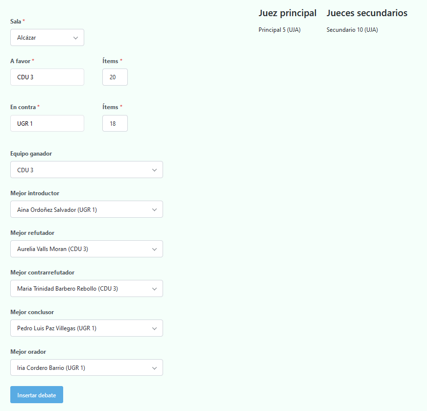
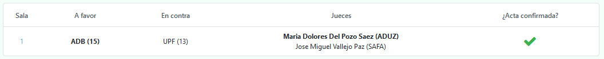
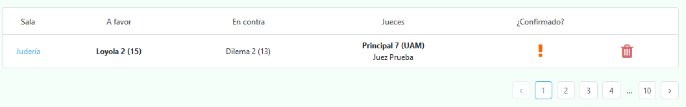

# Cómo insertar los debates de cada ronda

Existen dos formas, de manera directa o a través de los jueces.

## Inserción directa

Esta es la opción recomendada en caso de que no se desee crear cuentas para los jueces y pedirles a estos que inserten sus respectivos debates. Simplemente hay que dirigirse a la página `actas` y darle click a "Insertar acta".

Una vez hecho esto, y después de esperar unos segundos, aparecerá un desplegable con todas las salas donde se han realizado los debates de la ronda actual. (la cual se encarga de obtener los equipos a debatir en función de la sala especificada).

 Ejemplo de desplegable 

 

⚠️ El **desplegable** contiene únicamente las salas de aquellos debates que **aún no han sido insertados**. Por tanto, esta será cada vez menor a medida que insertas actas, hasta que se encuentre vacía y el programa automáticamente te redirija a la generación de los enfrentamientos de la siguiente ronda

Una vez selecciones una sala, se cargarán los datos asociada a esta:

* Equipos a favor y en contra

* Juez principal y secundarios (en caso de haber)

* Oradores de ambos equipos

Ejemplo de acta

 

💡
Si te has equivocado de sala, siempre puedes volver a seleccionar otra utilizando el desplegable.

Ahora lo único que resta es rellenar los datos en base a la hoja de ítems de cada sala.

⚠️ Como se puede apreciar, el acta no es una réplica de la hoja de ítems, sino que se deriva de esta.

Por lo tanto, en caso de que sean los jueces quienes envíen las actas digitales, y veas alguna disparidad, guíate siempre por lo que ponga la hoja de ítems.

Acta anterior rellenada

 

💡
Las menciones son opcionales, de tal modo que es posible no introducir un mejor orador, por ejemplo.

Una vez se ha insertado el debate, aparecerá en la tabla de actas.

Acta previamente insertada

 

Como se puede apreciar en la imagen, el equipo en negrita es el ganador, y el juez en negrita, el principal.

Además, al haber sido insertada por el tabulador, el debate aparece automáticamente como confirmado.

## Inserción a través de los jueces

Como ya se mencionó anteriormente, los jueces pueden registrarse en la aplicación, de tal forma que tengan una cuenta con rol de juez.

Iniciando sesión y dándole click en insetar debate, aparecerá directamente la sala que les toca juzgar (sin posibilidad de poder insertar otra) con los mismos formularios mostrados arriba.

Acta de juez (vista de móvil)

 

Una vez el acta ha sido rellenada y enviada, tendrán que esperar hasta que se genere la siguiente ronda donde tienen disponibilidad para insertar el siguiente debate.

 

Debate insertado por el juez (aún no confirmado)

 

Como puede apreciarse, el acta todavía no ha sido confirmada por parte del tabulador. A continuación se detallará el proceso de confirmación.

## Cómo confirmar un acta

Simplemente debemos darle click a la sala, donde veremos el formulario con los datos rellenados por el juez. Una vez hayamos comprobado que todos los datos son correctos, bastará con presionar el botón de confirmar debate y posteriormente darle click al pop-up que aparecerá a continuación.

 

Botón de confirmación de acta

 

Habiendo hecho esto, podremos observar cómo la acta de dicho debate se encuentra confirmada.

 

Acta confirmada

 

Una vez hayan sido **insertados y confirmados** todos los enfrentamientos de la ronda actual, se podrán generar los de la siguiente.