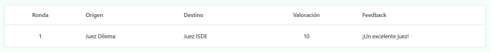

# Feedbacks

Tabademic brinda la posibilidad de que tanto los equipos como los jueces puedan enviar feedbacks, de tal forma que desde organización se tenga una idea más clara del nivel de valoración de cada juez.

## Feedbacks entre jueces

Una vez un juez haya enviado un acta, este podrá enviar feedback a (en caso de ser secundario) o a todos sus principales (en caso de ser principal).

En `Feedbacks de jueces` podremos verlos mediante una tabla ordenada por ronda.

## Feedbacks entre jueces y equipos

Del mismo modo, los equipos pueden valorar al juez principal de su sala. Dicha información vendrá recogida en una tabla similar a la anterior.

Podemos verlos en `Feedbacks de equipos`

⚠️ Por el momento, **ningún juez puede ver los feedbacks que se le han hecho** (ya vengan de otros jueces o de los equipos a los que ha juzgado). Si deseas esta característica, contacta por favor con el desarrollador.

