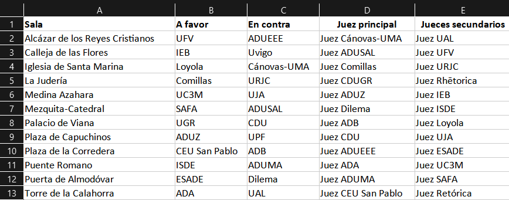

# Generación de enfrentamientos

## Disponibilidad de jueces

Siempre que se vayan a generar los enfrentamientos de una ronda, es muy recomendable echarle un vistazo a la **disponibilidad de los jueces** (la cual se encuentra bajo la pestaña de `Debates`).

En dicha página será posible en qué rondas está disponible cada juez, facilitando así el saber quiénes juzgarán la siguiente.

Disponibilidades de los 10 primeros jueces

 

💡
Recuerda que puedes cambiar las disponibilidades en cualquier momento yendo al juez en cuestión

## Flujo

Cuando hablamos de generar enfrentamientos, nos referimos a los de la siguiente ronda. Esto se podrá hacer únicamente si hemos insertado todos los debates de la ronda actual (exceptuando el caso en el que acabemos de empezar el torneo, donde es posible generar directamente los de la primera ronda).

De manera resumida, estos son los pasos a seguir:

1. Insertar y confirmar las actas de los debates de la ronda actual.

2. Generar los enfrentamientos de la siguiente

3. Volver al paso 1.

Esto se realizará hasta que hayamos insertado la final, en cuyo caso ya habremos terminado.

💡
La ronda inicial será 0, por lo que cuando generemos los primeros enfrentamientos, estos corresponderán a los de la primera ronda.

## Cómo se calculan

Esto dependerá de la ronda en cuestión.

### Rondas clasificatorias

La primera de forma totalmente **aleatoria**, mientras que el resto mediante el **método suizo**.

#### Método suizo y criterios de clasificación

El método suizo que aplica Tabademic consiste en las siguientes fases:

**1. Ordenar los equipos de acuerdo a su número de victorias**

Si hay 2 ó más empatados, se aplicará el criterio seleccionado en el menú de configuración.

**2. Emparejar equipos de forma adyacente**

El primero contra el segundo, el tercero con el cuarto... siempre teniendo en cuenta **las siguientes restricciones**:

* Que ningún equipo debata **AF o EC más de la cuenta** (para impedir que, si por ejemplo el torneo tiene 5 rondas, nadie haga 4 AF ó 4 EC) o que **haga la misma postura 3 veces seguidas**

* Ambos equipos **no se hayan enfrentado anteriormente**

Si alguna de dichas restricciones no se pudiera cumplir, se realizaría otro emparejamiento.

Por poner un ejemplo, si estamos en la sexta y última ronda y el primer equipo de la clasificación ya se ha enfrentado contra el segundo (cosa bastante común por el propio sistema suizo), el primero se enfrentaría al tercero y el segundo al cuarto.

O si en vez de habersen enfrentado anteriormente, hubieran debatido A Favor sus dos últimas rondas, se realizaría lo mismo, para evitar que uno de ellos debata dicha postura 3 veces seguidas.

Estas sustituciones se harán de tal forma que el suizo se vea impactado lo mínimo posible, garantizando (salvo en contadísimas excepciones que por supuesto se podrán modificar manualmente) que ambos equipos tengan una diferencia de como mucho una victoria.

**3. Calcular las posturas**

Una vez Tabademic sabe qué dos equipos se enfrentan, elige las posturas de la forma más equitativa posible (si por ejemplo estamos en la segunda ronda y el equipo A acaba de debatir AF y el B en contra, A sería EC y B a favor). Si ambos hubieran hecho la misma postura, se eligiría al azar.

⚠️
Si ves algún emparejamiento extraño (ya sea porque hay mucha diferencia de nivel o porque las posturas no son correctas), recuerda que puedes modificar los enfrentamientos a mano. Se agradecería enormemente que avisaras también al desarrollador para que lo arregle lo antes posible.

### Rondas finales

En la primera ronda final, pasan N equipos (16 si son octavos, 8 si son cuartos, etc.), enfrentándose el primer clasificado contra el último, el segundo contra el penúltimo, y así sucesivamente.

En las siguientes, se enfrentan únicamente aquellos equipos que han ganado en la ronda anterior, quedando de esta forma cada vez menos equipos en la competición, hasta acabar únicamente con dos de ellos (los cuales debatirán la final).

 

⚠️ La generación de enfrentamientos únicamente tiene en cuenta qué equipos se enfrentarán en cada debate. Las posturas de cada uno vendrán determinadas por el número de debates AF y EC que haya debatido cada equipo hasta el momento, de tal manera que exista un equilibrio en dicho sentido (exceptuando en la primera ronda y en las rondas finales, donde las posturas se determinarán  al azar).

## Cómo se generan

Para comenzar, simplemente habrá que darle click a `Generar enfrentamientos`, la cual se encuentra bajo la pestaña `Debates`. Una vez hecho esto, el programa comenzará a comprobar que todos los datos están debidamente insertados (apareciendo un icono de espera mientras dura el proceso).

Si todo ha salido bien, aparecerá un breve mensaje de confirmación, seguido de la tabla con los enfrentamientos correspondientes a la siguiente ronda.

Enfrentamientos de la primera ronda

 

 

💡 Exceptuando la primera ronda (sin formato suizo) y las finales, los enfrentamientos vendrán ordenados de **mejor a peor en la clasificación**, aunque una vez se generen, será posible reordenarlos para que los equipos no puedan intuir sus posiciones.

## Tabla de enfrentamientos

Esta contiene a todos los equipos y jueces marcados como disponibles para la siguiente ronda, indicándonos un enfrentamiento por cada fila con los siguientes detalles:

* La sala donde se desarrollará el debate

* El equipo a favor

* El equipo en contra

* El juez principal

* Los jueces secundarios (en caso de haber)

## Cómo modificarlos

Estos enfrentamientos **no tienen por qué ser definitivos**, siendo únicamente los que Tabademic ha considerado más adecuados en base a su algoritmo de generación de enfrentamientos (el cual se explicó en dellate anteriormente) y a la puntuación asignada a cada juez (siendo los N mejores principales y el resto secundarios). Es por tanto posible modificarlos.

### Modificar equipos

Es posible arrastrar y soltar los diferentes equipos de la tabla, cambiando de este modo qué equipos se enfrentan entre sí (o simplemente sus posturas).

 

⚠️ Se recomienda realizar esta acción únicamente en casos muy concretos, ya que se podría alterar el sistema suizo.

### Modificar jueces

Al darle click a cualquier celda, aparecerá un pequeño formulario. Simplemente debemos escribir el nombre del juez que queremos que esté allí, y ya estaría. Si ya había un juez, se cambiará por el nuevo (a menos que no se encontrase previamente en la tabla, claro está).

💡
Para añadir un juez secundario a una sala determinada, dale click al icono ➕ y escribe su nombre.

Cada vez que se realice un cambio (ya sea de equipos o de jueces), Tabademic comprueba automáticamente si existe alguna restricción tanto en la sala de origen como de destino.

En caso de haber una, aparecerá un icono en la última columna en el que, al posar el ratón sobre el mismo, mostrará la restricción en cuestión (o una lista en caso de tratarse de más de una). 

Ejemplo de incompatibilidad de club

 

 

#### Tipos de restricciones

La siguiente lista contiene todas las restricciones que Tabademic tiene en cuenta a la hora de generar los enfrentamientos:

* Que no haya un juez principal en una determinada sala.

* Que el juez principal no sea el que tenga mayor puntuación en su sala.

* Que un equipo haya sido juzgado anteriormente (ya sea en la última ronda del juez o en cualquier otra)

* Incompatibilidad de club, el cual puede darse ya sea porque el juez pertenece al mismo club del equipo, o porque se ha especificado en el apartado de `Incompatibilidades entre jueces y clubes`.

* Incompatibilidad entre jueces

* Incompatibilidad entre un juez y un equipo en específico

* Que dos equipos ya se hayan enfrentado

* Que dos equipos tengan posturas "injustas" (por ejemplo 3 AF o EC seguidos)

* Que dos equipos tengan una diferencia de 2 o más número de victorias

## Confirmar enfrentamientos

Una vez estemos conformes con el resultado deseado, simplemente debemos darle click a `Generar enfrentamientos`. Una vez hecho esto, se descargará automáticamente un éxcel con los enfrentamientos que acabamos de confirmar, de tal forma que los podamos tener a mano fácilmente de cara al anuncio de los mismos.

Éxcel con los enfrentamientos de la primera ronda

 

 

⚠️ Si hay al menos una restricción, el botón estará en naranja en vez de azul. Aún así, es posible generarlos, así que no te preocupes.

Puede haber casos muy concretos en los que sí o sí haya restricciones (como cuando se trata de un torneo interno en el que no es posible evitar en alguna sala incompatibilidad de club). En dicho caso, simplemente intenta modificarlos hasta que consigas los enfrentamientos que más se adecúen a tus necesidades.

💡
Como ya se comentó, dependiendo de la ronda generada, será posible reordenar las salas de tal forma que estas no queden de mejor a peor. Dicho éxcel ya tendrá en cuenta dicha reordenación en caso de haberse seleccionado.

💡
Si ha habido un cambio de última hora que te fuerza a modificar los enfrentamientos de una ronda, no te preocupes. Simplemente vuelve a la anterior desde el menú de configuración y genéralos de nuevo.

¡Ahora que se han generado los enfrentamientos, simplemente queda esperar a que los debates terminen para poder insertar sus respectivas actas!