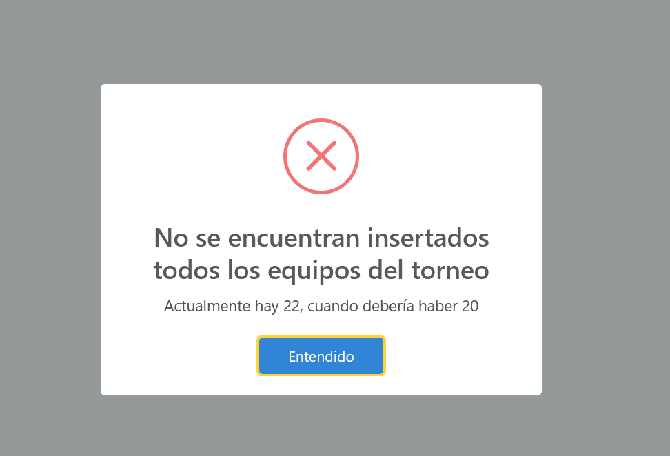
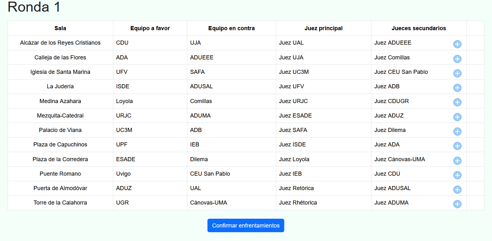
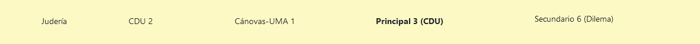
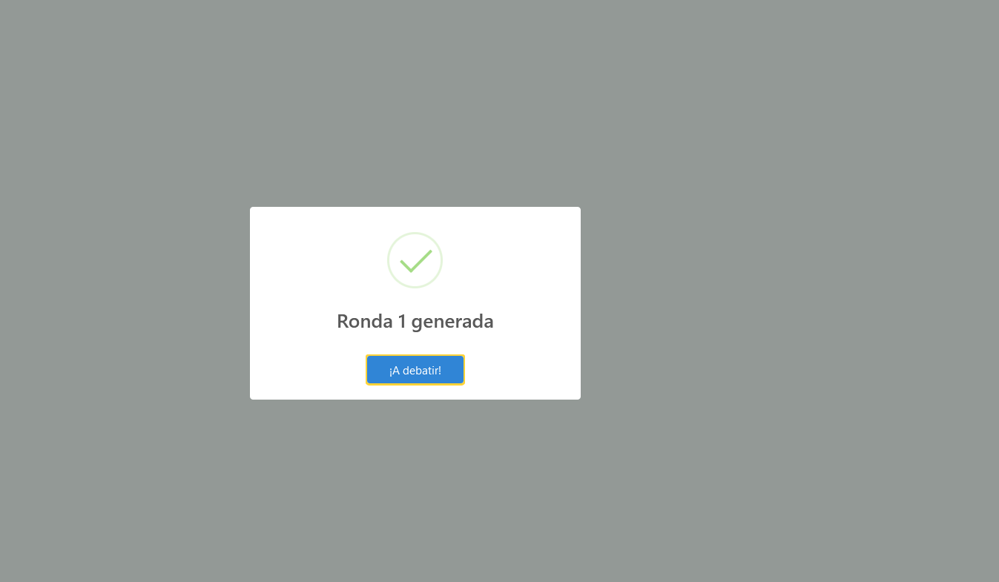

# Generación de enfrentamientos

## Prerrequisitos

Además de **haber insertado todos los datos mostrados previamente**, es recomendable echarle un vistazo a la **disponibilidad de los jueces** (la cual se encuentra bajo la pestaña de Debates).

En dicha página será posible ver qué jueces estarán disponibles en cada ronda, facilitando así el saber quiénes juzgarán la siguiente ronda.

Algunos jueces de la primera ronda

 

💡
También es posible insertar o borrar disponibilidades desde esta entidad.

## Flujo

Cuando hablamos de generar enfrentamientos, nos referimos a los de la siguiente ronda. Esto se podrá hacer únicamente si hemos insertado todos los debates de la ronda actual (exceptuando el caso en el que acabemos de empezar el torneo, ya que podremos generar directamente los de la primera ronda).

De manera resumida, estos son los pasos a seguir:

1. Insertar los debates de la ronda actual (excepto si nos encontramos en la ronda inicial).

2. Generar los enfrentamientos de la siguiente (y confirmarlos en caso de que sean los jueces quienes los inserten).

3. Volver al paso 1.

Esto se realizará hasta que hayamos insertado la final, en cuyo caso ya habremos terminado.

💡
La ronda inicial será 0, por lo que cuando generemos los primeros enfrentamientos, estos corresponderán a los de la primera ronda.

## Cómo se calculan

Esto dependerá de la ronda en cuestión.

### Rondas clasificatorias

La primera de forma totalmente **aleatoria**, mientras que el resto mediante el **método suizo**.

💡
El método suizo que aplica Tabademic consiste en ordenar a los equipos de mejor a peor y hacer que se enfrenten el primero contra el segundo, el tercero contra el cuarto...

### Rondas finales

En la primera ronda final, pasan N equipos (16 si son octavos, 8 si son cuartos, etc.), enfrentándose el primer clasificado contra el último, el segundo contra el penúltimo, y así sucesivamente.

En las siguientes, se enfrentan únicamente aquellos equipos que han ganado en la ronda anterior, quedando de esta forma cada vez menos equipos en la competición, hasta acabar únicamente con dos de ellos (los cuales debatirán la final).

 

⚠️ Esto únicamente determina qué equipos se enfrentarán en cada debate. Las posturas que tendrán cada uno vendrán determinadas por el número de AF y EC que ha debatido cada equipo hasta el momento, de tal manera que exista un equilibrio en dicho sentido (exceptuando la primera ronda y las rondas finales, donde se determinará al azar).

## Cómo se generan

Para comenzar, simplemente habrá que darle click a la página del mismo nombre, la cual se encuentra bajo la pestaña `Debates`. Una vez hecho esto, aparecerá un icono de carga indicándonos que se están comprobando todos los datos del torneo y evitar así que haya algún problema a posteriori.

Pantalla de carga

 

 

⚠️ Si aparece algún mensaje de error tras la comprobación de datos, no te preocupes en absoluto. Simplemente léelo atentamente para saber qué ha salido mal y cómo se puede solucionar.

Ejemplo de error

 

Si todo ha salido correctamente, se mostrará un pequeño mensaje confirmando que todo ha ido bien y posteriormente la tabla con los enfrentamientos en cuestión.

Enfrentamientos de la primera ronda

 

## Tabla de enfrentamientos

Esta contiene a todos los equipos y jueces marcados como disponibles para la siguiente ronda, indicándonos un enfrentamiento por cada fila con los siguientes detalles:

* La sala donde se desarrollará el debate

* El equipo a favor

* El equipo en contra

* El juez principal

* Los jueces secundarios (que en caso de no haber se mostraría una celda vacía)

Cabe aclarar que estos enfrentamientos **no tienen por qué ser definitivos**, siendo únicamente los que Tabademic ha considerado adecuados en base a su programación. Es por tanto posible modificarlos mediante **drag and drop**.

## Drag and drop

La operación de drag and drop (o arrastrar y soltar en castellano) permite realizar un intercambio entre las distintas celdas de la tabla.

A continuación se detallarán sus principales usos.

### Modificar enfrentamientos

Podemos alterar qué equipos se enfrentan entre sí (o simplemente cambiar las posturas AF y EC).

 

⚠️ Se recomienda realizar esta acción únicamente en la primera ronda o en casos muy concretos, ya que se podría alterar tanto el sistema suizo como la generación de rondas finales.

### Modificar jueces

Tabademic asigna los jueces de acuerdo a dos criterios:

* Puntuación, siendo los mejores los principales, y el resto secundarios.

* Incompatibilidades, tratando que no haya ninguna.

En caso de que queramos modificarlos, basta con arrastrar un principal a un secundario, o viceversa.

💡
También puedes añadir un secundario a una sala. Simplemente debes arrastrarlo hasta el borde inferior de la celda en cuestión.

Cada vez que se arrastra un juez de una celda a otra, se comprueba que no haya ninguna incompatibilidad tanto en la sala de origen como de destino (en caso de un desplazamiento horizontal, ambos coincidirán).

En caso de haber una, la celda en cuestión cambiará de color, indicando que existe una determinada incompatibilidad.

Ejemplo de incompatibilidad de club

 

### Lista de incompatibilidades

La siguiente tabla detalla todas las incompatibilidades que puede haber a la hora de generar enfrentamientos, con su color correspondiente y una pequeña descripción.

<table>

  <tr>
    <th>Incompatibilidad</th>
    <th>Descripción</th>
  </tr>

  <tr class="no-principal">
    <td>No hay principal</td>
    <td> El enfrentamiento en cuestión no cuenta con ningún juez principal</td>
  </tr>
  
  <tr class="incompatibilidad-club">
    <td>Incompatibilidad de club</td>
    <td>Al menos uno de los jueces pertenece al mismo club (actual o antiguo) de al menos uno de los dos equipos</td>
  </tr>

<tr class="juzgado-anteriormente">
    <td>Equipo juzgado anteriormente</td>
    <td>Al menos uno de ambos equipos ha sido previamente juzgado por al menos uno de los jueces</td>
  </tr>

<tr class="incompatibilidad-jueces">
    <td style="background-color: #c26cdf;">Incompatibilidad de jueces</td>
    <td>Existe al menos una incompatibilidad entre 2 jueces</td>
  </tr>

<tr class="incompatibilidad-jueces-equipos">
    <td>Incompatibilidad de jueces y equipos</td>
    <td>Existe al menos una incompatibilidad de juez a equipo</td>
  </tr>

<tr class="principal-incorrecto">
    <td>Principal no recomendado</td>
    <td>El juez principal tiene menos puntuación que alguno de los secundarios</td>
  </tr>

</table>

 

### Eliminar jueces

Es posible que haya jueces que en principio dijesen que estarían disponibles para una determinada ronda, pero que al final por diversas circunstancias no hayan podido estar presente en la misma.

En tales casos, existe la posibilidad de eliminarlo de la tabla de enfrentamientos, simplemente arrastrándolo a la pepelerita que se encuentra en la esquina superior derecha, impidiendo así que juzgue ningún enfrentamiento de la ronda actual.

💡
En caso contrario (que necesites a un juez que no se encuentra), simplemente búscalo en la tabla de jueces, marca en disponibilidades la ronda deseada, y vuelve a generar los enfrentamientos. Ahora debería estar presente.

### Confirmar enfrentamientos

Una vez estemos conformes con el resultado deseado, simplemente debemos darle click al botón que dice "Generar enfrentamientos".

 

⚠️ Si hay al menos una incompatibilidad, el botón estará en naranja en vez de azul. Aún así, es posible generarlos, así que no te preocupes.

Puede haber casos muy concretos en los que sí o sí haya incompatibilidades (como cuando se trata de un torneo interno). En dicho caso, simplemente intenta modificarlos hasta que consigas los enfrentamientos que más se adecúen a tus necesidades.

Primera ronda generada satisfactoriamente

 

💡
Si hay un cambio de última hora y debes modificar los enfrentamientos una vez han sido generados, recuerda que puedes simplemente reiniciar la ronda actual desde el menú de configuración y volver a comenzar el proceso.

¡Ahora que se han generado los enfrentamientos, simplemente resta esperar a que se terminen los debates e insertarlos!