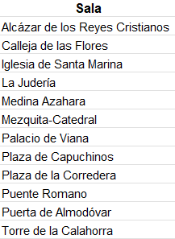
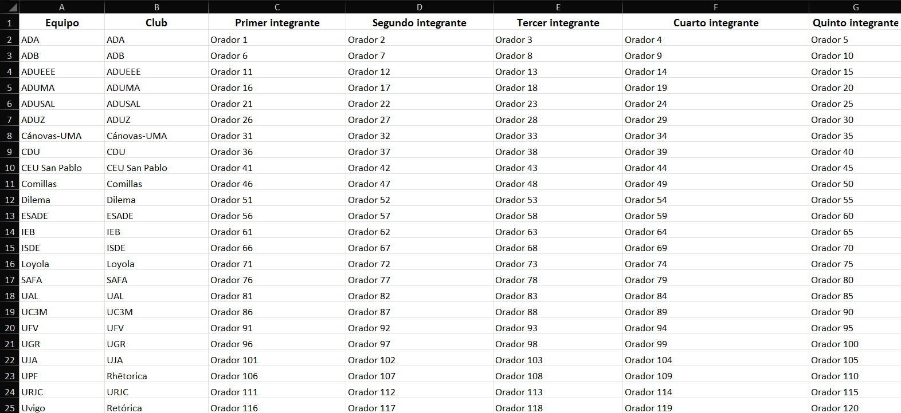
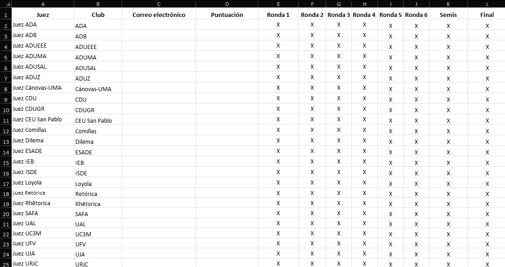
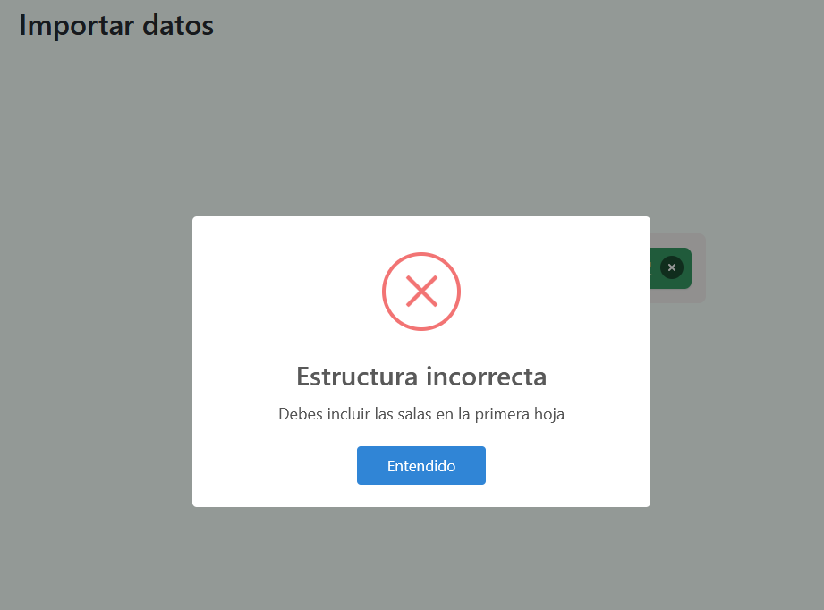
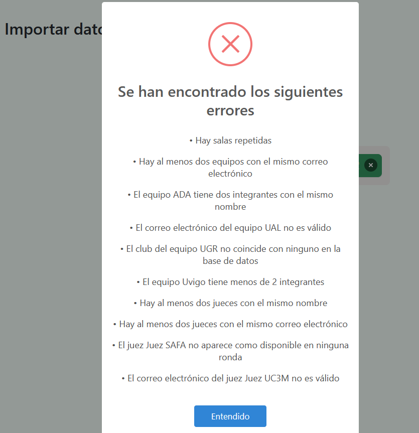
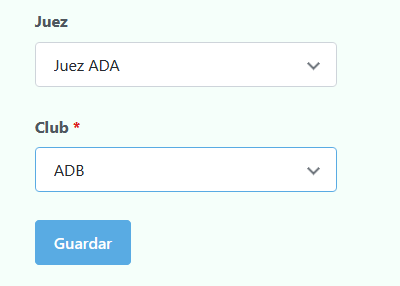

# Insertar datos

Una vez configurado el torneo el siguiente paso es insertar los datos del mismo, en concreto:

* Salas

* Equipos

* Oradores

* Jueces

* Incompatibilidades entre jueces (en caso de haber)

* Incompatibilidades entre jueces y equipos (en caso de haber)

* Incompatibilidades entre jueces y clubes (en caso de haber)

💡
Puedes acceder a cada uno desde la barra lateral, expandiendo Datos del torneo.

## Importar datos mediante un único fichero Excel

Para facilitar en la mayor medida de lo posible este procedimiento, Tabademic cuenta con la posibilidad de que los datos se inserten mediante un fichero éxcel, donde se podrá insertar de una vez salas, equipos, oradores y jueces (más adelante se verá en detalle cómo incluir las incompatibilidades).

El mismo debe contar con 3 hojas denominadas **Salas, Equipos y Jueces** respectivamente.

### Salas

Una única columna con todas las salas que vayas a disponer durante el torneo.

### Equipos

La cual cuenta con las siguientes columnas

* Nombre del equipo
* Club al que pertenece (debe coincidir con alguno de [esta lista](lista_clubes))
* Correo electrónico (si no va a haber feedbacks se recomienda dejarlo en blanco)
* Primer integrante
* Segundo integrante
* Tercer integrante
* Cuarto Integrante
* Quinto integrante

⚠️ Cada equipo tiene que estar **conformado por al menos 2 integrantes**, por lo que el tercer, cuarto y quinto pueden estar en blanco.

 

### Jueces

Del mismo modo que antes, podemos importar los jueces del torneo mediante otro éxcel. En este caso, las columnas que debe contener son las siguientes:

* Nombre del juez

* Club al que pertenece (también debe estar en [esta lista](lista_clubes))

* Correo electrónico (para agilizar el envío de URLs privadas, aunque puede dejarse en blanco si así se desea)

* Puntuación (cuanto más alto más probable que ese juez sea principal; puede estar en blanco, transformándose en un 0 posteriormente).

* Una columna por cada ronda del torneo (tanto clasificatoria como final), marcando con una X (o cualquier otra letra que se desee) la disponibilidad en cuestión.

 

💡 No te preocupes si las disponibilidades no son definitivas ya que estas se pueden modificar juez a juez posteriormente.

### Cómo subir el fichero

Simplemente selecciona `Importar datos` desde la barra lateral. Allí verás un área en el que o bien puedes darle click y seleccionar el archivo, o arrastrarlo y soltarlo.

Una vez hecho eso, dale click a `Subir datos` y Tabademic se encargará del resto.

### Validaciones

Si ha habido algún tipo de error en los datos (ya sea porque la estructura del éxcel no es adecuada o porque hay datos incorrectos), aparecerá un popup indicando el error en cuestión, de tal forma que puedas corregirlo al instante y volver a subir el archivo.

Popup mostrando estructura incorrecta

 

Popup mostrando datos incorrectos

 

Una vez esté todo correcto, aparecerá un popup indicando que los datos se han insertado satisfactoriamente, ahorrándonos una gran cantidad de tiempo comparado con su subida manual.

### A tener en cuenta

* En caso de que ya hayas subido el éxcel y haya cambios de última hora, simplemente actualízalo en tu ordenador y vuélvelo a subir. Tabademic **reemplazará** todo lo que hubiera actualmente con los datos actualizados.

* Por lo anterior, no se aconseja que vuelvas a subir el éxcel de jueces una vez les hayas entregado sus URLs privadas, **ya que estas cambiarán y tendrás que volver a enviarlas**. Si los cambios son muy pequeños (como añadir un equipo o modificar el correo de un juez), hazlo de manera manual (es algo más engorroso, pero tampoco supondrá mucho problema al tratarse de modificaciones puntuales).

¡Ahora solo resta insertar las incompatibilidades!

### Incompatibilidades

Tabademic permite incluir los siguientes tipos de incompatibilidades:

* Entre jueces

* Entre jueces y equipos

* Entre jueces y clubes

#### Entre jueces

Para incluir este tipo de incompatibilidad, simplemente basta con seleccionar en el primer desplegable el juez en cuestión, y en el segundo la incompatibilidad en sí.

 

💡
No hay límite en cuanto al número de incompatibilidades que puede tener un mismo juez

#### Entre jueces y equipos

Muy similar a la entidad anterior, solo que esta vez el segundo desplegable se refiere al equipo en cuestión.

💡
Solo aparecerán equipos distintos al del club del juez, ya que dicha incompatibilidad ya se tiene en cuenta automáticamente

 

#### Entre jueces y clubes

Obviando el propio club (por lo ya explicado anteriormente), es posible indicar para cada juez con qué otros clubes tiene incompatibilidad, de tal forma que no pueda juzgar ningún equipo que pertenezca a dichas instituciones (aunque sí podrá juzgar con jueces que pertenezcan a dichos clubes).

La forma de insertarlos es similar a las dos anteriores, teniendo un desplegable con el juez en cuestión y otro con el club.

⚠️ Solamente se mostrarán los clubes de los equipos insertados (de tal forma que no se pueda elegir uno que no tenga relación con ningún equipo del torneo)

 

## Inserción manual

Aunque se recomienda el método anterior para insertar los datos del torneo, también es posible realizarlo de manera manual. Para ello simplemente basta con irse a cada entidad e ir introduciendo la información poco a poco (los campos son los mismos vistos con anterioridad).

⚠️ Ten en cuenta que el orden de inserción importa. Por ejemplo, no puedes insertar un orador sin antes haber introducido su correspondiente equipo.

