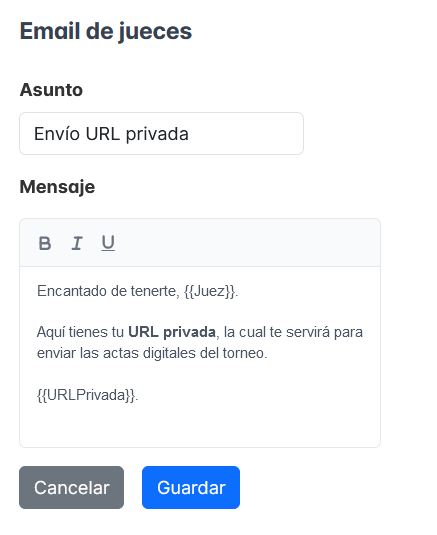

# Primeros pasos

## Solicitar la creación del torneo

Tabademic no require de ningún tipo de instalación, ya que toda su funcionalidad se encuentra **alojada en la web**. Sin embargo, dado que cada torneo requiere de su propia base de datos, es necesario que el desarrollador la cree primero. Sus datos de contacto los puedes encontrar [aquí](desarrollador.md).

Una vez esté todo listo, recibirás un usuario y una contraseña con los que podrás comenzar a utilizar la aplicación sin ningún tipo de conocimientos técnicos.

 

⚠️ Con dichas credenciales tendrás acceso de lectura/escritura a absolutamente todos los datos del torneo. 
Asegúrate por favor de no compartir la contraseña con nadie.  En caso de una brecha de seguridad, contacta inmediatamente con el desarollador.

## Iniciar sesión 🔑

Para ello accede a [la página principal](https://tabademic.com) e introduce el usuario y contraseña obtenidos en el paso anterior.

Si todo ha salido bien, saldrás al menú de configuración.

## Configurar el torneo ⚙️

Tabademic cuenta con diversas opciones de configuración, de tal forma que pueda adaptarse a las necesidades de cada torneo en particular.

En ella podremos realizar las siguientes configuraciones:

### Datos del torneo

* Número de rondas clasificatorias y finales

* Valor mínimo y máximo de ítems (además de su formato)

* Criterio de desempate en el caso de que dos o más equipos tengan el mismo número de victorias

* ¿Es un torneo interno? Esto es útil ya que no se tendrán en cuenta incompatibilidades de club al generar los enfrentamientos.

* ¿Habrá menciones para cada postura o por el contrario cada orador contará con una puntuación?

 

⚠️ El número de rondas no se podrá cambiar una vez se hayan generado los enfrentamientos de la primera ronda.

### Jueces

* ¿Los jueces se asignarán de manera automática o de forma manual?

* ¿Cada juez tendrá una URL privada para poder insertar sus actas? Si esta opción esta desactivada, el tabulador deberá encargarse de enviar todas las actas por su cuenta.

### Enfrentamientos

* ¿Formato suizo o se enfrentarán todos los equipos entre sí? Esta última opción es muy útil en torneos pequeños, como por ejemplo en internos

### Posturas

* ¿Estas serán por sorteo o calculadas automáticamente por Tabademic? En el apartado de generación de enfrentamientos se profundizará más acerca de dicho cálculo.

### Ronda actual

En la cual es posible:

* **Liberarla**, permitiendo de esta manera que los jueces de dicha ronda puedan enviar sus actas. Esto es especialmente útil en la primera ronda, de tal forma que no se "filtren" los enfrentamientos. Además, es posible deshacer la liberación volviéndole a dar click.

💡
Esta opción solo estará disponible si los jueces tienen URLs privadas.

* **Reiniciar ronda actual**, la cual permite volver a modificar los enfrentamientos de la ronda actual en caso de que haya habido algún cambio de última hora (estos se guardan de manera automática, así que simplemente habrá que hacer el cambio deseado y volver a confirmar).

💡
En caso de que haya al menos un acta insertada en la ronda actual, no será posible seleccionar esta opción (a fin de cuentas su uso está pensado únicamente para minutos posteriores a la generación de la ronda, es decir, mucho antes de que los debates estén próximos a terminar).

### Plantillas de emails

En caso de que los jueces de nuestro torneo cuenten con URLs privadas, Tabademic permite el envío de estas mediante correo electrónico, contando por tanto con una plantilla para que el mensaje sea a gusto de la organización del torneo.

Su configuración es sumamente sencilla ya que basta con especificar tanto el asunto como el mensaje. Para que en este último se refleje la URL privada y el nombre de cada juez, habrá que escribir **{{URLPrivada}}** y **{{Juez}}** respectivamente.

Ejemplo de la plantilla de los jueces

 

 

Además, es posible encontrar los siguientes dos botones:

* **Limpiar enfrentamientos guardados:** Cada vez que se generen los enfrentamientos de una ronda, estos se guardarán de forma automática (para en caso de que tengamos que corregir algo, podamos reiniciarla y simplemente hacer los cambios oportunos). Al darle click y volver a generar los enfrentamientos de la ronda actual, Tabademic se encargará de los enfrentamientos (en función de cómo hayamos configurado el torneo, claro está).

 

* **Eliminar todos los datos del torneo:** Muy útil en caso de que hubiéramos estado jugando un poco con la aplicación antes de insertar los datos reales.