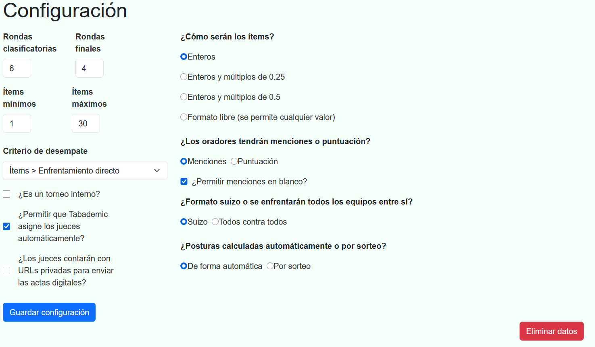

# Primeros pasos

## Solicitar la creación del torneo

Tabademic no require de ningún tipo de instalación, ya que toda su funcionalidad se encuentra **alojada en la web**. Sin embargo, cada torneo debe
de ser creado de antemano por el desarrollador del programa. Sus datos de contacto los puedes encontrar [aquí](desarrollador.md).

Una vez se haya creado el torneo, recibirás la URL del mismo, un usuario y una contraseña, con los que podrás comenzar a utilizar la aplicación sin ningún tipo de conocimientos técnicos.

 

⚠️ El usuario previamente mencionado tiene  rol de tabulador , el cual tiene acceso de lectura/escritura a absolutamente todos los datos del torneo.
Asegúrate por favor de no compartir la contraseña con nadie.  En caso de una brecha de seguridad, contacta inmediatamente con el desarollador.

## Iniciar sesión 🔑

Una vez le des click a la URL del torneo, aparecerá la siguiente página de login.

Simplemente debes iniciar sesión con el usuario y contraseña obtenidos en el paso anterior. Después de ello, serás redirigido a la página de configuración.

## Configurar el torneo ⚙️

Tabademic cuenta con diversas opciones de configuración, de tal forma que pueda adaptarse a las necesidades de cada torneo en particular.

En ella podremos configurar los siguientes parámetros, divididos en 3 categorías:

### Datos del torneo

* Valor mínimo y máximo de ítems

* 쮼s un torneo interno?

* 쮼s un sistema todos contra todos?

* 쯉e emplearán votos en vez de ítems en las rondas finales?

### Menciones

De tal forma que a la hora de rellenar actas solo aparezan las seleccionadas en este apartado.

### Ronda actual

* Reiniciarla, es decir, eliminar todas las actas de la ronda actual y volver a la ronda anterior. Suele recomendarse su uso únicamente en caso de que se hayan generado los enfrentamientos de una ronda de manera incorrecta y se necesiten volver a generar.

* Liberarla a los jueces, permitiendo de esta manera que puedan enviar actas (y deshacer la liberación en caso de que deseemos hacerlo).

 

⚠️ Pulsar de manera continuada el botón de reiniciar ronda actual hará que se vayan eliminando una ronda tras otra del torneo. Utilizar con sumo cuidado.

Además, es posible encontrar los siguientes dos botones:

* **Guardar cambios** -> Guarda la configuración.

* **Eliminar todos los datos del torneo** --> Muy útil en caso de que queramos eliminar los datos de prueba y comenzar a insertar los reales.

Ejemplo de configuración
