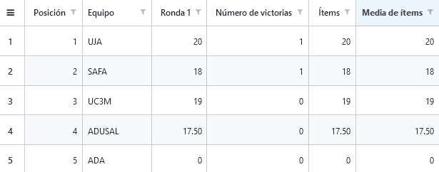
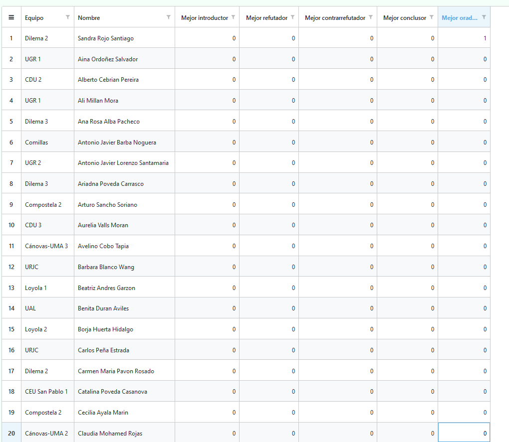
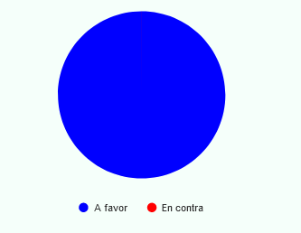
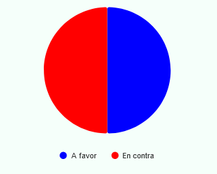

# Resultados

En la pestaña del mismo nombre podremos obtener resultados de diferente índole, los cuales se actualizan **en tiempo real cada vez que un debate es insertado**.

⚠️ Dicha actualización ocurrirá únicamente en las **rondas clasificatorias**. Si quieres que también se incluyan las rondas finales, contacta con el desarrollador.

## Clasificación

La cual se basa en el siguiente criterio:

* Número de victorias

* Enfrentamiento directo

* Ítems

💡
Si necesitas otro criterio (o incluso más campos para las actas), contacta con el desarrollador.

Esta consiste en una tabla con los equipos ordenados desde la primera posición hasta la última, donde cada fila contiene la siguiente 
información:

* Posición

* Equipo

* Puntuación en cada ronda

* Número de victorias

* Ítems totales

* Media de ítems

11 primeros equipos de la clasificación

 

Como se puede observar, el único debate insertado fue el que enfrentaba a  Loyola 2 y Dilema 2 (de ahí que aparezcan los primeros, ya que son los únicos que tienen ítems hasta ahora).

A medida que se inserten más y más debates, la clasificación irá tomando cada vez más forma, hasta que se llegue a la última ronda final, donde se podrá ver claramente qué equipos pasan a la siguiente fase.

💡
Si quieres, puedes descargarla en formato excel dándole click derecho a la primera celda y luego en Export => to Excel.

Además, en caso de que se desee, es posible liberar la clasificación a los equipos **(a través de una URL de la forma https://personal-4ude2rxh.outsystemscloud.com/NombreTorneo/ClasificacionPublica)**.

Para ello, basta con darle click al botón "Actualizar clasificación pública".

💡 La clasificación pública será exactamente igual al momento de la liberación. Si se desea actualizar (ya que se ha avanzado de ronda, por ejemplo), basta con volverle darle click al botón.

⚠️ Si deseas ocultar la clasificación (ya sea porque la liberaste sin querer o por cualquier otro motivo), simplemente dale click en "Liberar clasificación pública"

## Menciones de oradores

Como su nombre indica, es posible observar por cada orador, las diferentes menciones que este ha tenido en cada rol. Para ello, se cuenta con una tabla similar a la de clasificación (la cual también puede ser descargada a formato excel de la misma forma).

💡
Para ordenar los oradores por mención, basta con darle doble click a la celda con el nombre de la mención deseada. 

Oradores ordenados por mejor orador

 

Como se puede apreciar, la primera posición la ostenta Sandra Rojo, la cual fue la mejor oradora del único debate insertado hasta el momento. De igual forma que con la clasificación, a medida que se inserten más debates, las menciones de oradores irán actualizándose progresivamente.

⚠️ No es posible liberar las menciones de los oradores. Aún así, en caso de que se desee, se puede descargar la tabla en formato Excel y enviarla a quien se considere oportuno.

## Porcentaje de victorias AF/EC

Una estadística muy útil cuando se desea saber en qué medida está sesgada la pregunta a debatir.

Es un gráfico circular donde la sección azul corresponde a las victorias a favor y la roja a las de en contra.

Gráfico

 

Como solo ha habido un debate insertado, el cual ha ganado la postura a favor, el gráfico es enteramente azul.

Porcentaje equilibrado después de insertar un acta en cuyo debate ha ganado la postura en contra

 

