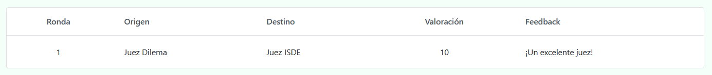
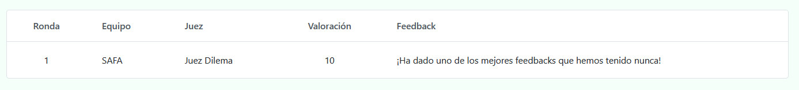

# Resultados

En este apartado podremos ver información muy útil referente al torneo. Concretamente:

* Clasificación
* Menciones de oradores
* Porcentaje de victorias AF/EC
* Feedbacks entre jueces
* Feedbacks de equipos a jueces

⚠️ Los 3 primeros se actualizan en tiempo real cada vez que **un acta es confirmada**, aunque solo en las **rondas clasificatorias**. Si quieres que también se incluyan en las rondas finales, contacta con el desarrollador.

## Clasificación

La cual se basa en el siguiente criterio:

* Número de victorias

* Enfrentamiento directo

* Ítems

💡
Si necesitas otro criterio (o incluso más campos para las actas), contacta con el desarrollador.

Esta consiste en una tabla con los equipos ordenados desde la primera posición hasta la última, donde cada fila contiene la siguiente 
información:

* Posición

* Equipo

* Puntuación en cada ronda

* Número de victorias

* Ítems totales

* Media de ítems

Clasificación actual después de las 2 actas anteriores

 

Como únicamente hemos insertado 2 actas hasta ahora, los 4 equipos participantes de estas son los que ostentan las primeras posiciones. A medida que se inserten más y más debates, la clasificación irá tomando cada vez más forma, hasta que se llegue a la última ronda final, donde se podrá ver claramente qué equipos pasan a la siguiente fase.

💡
Si quieres, puedes descargarla en formato Excel dándole click derecho a la primera celda y luego en Export => to Excel.

Además, en caso de que se desee, es posible liberar la clasificación a los equipos a través de una URL de la forma **https://personal-4ude2rxh.outsystemscloud.com/NombreTorneo/ClasificacionPublica**

Para ello, basta con darle click al botón "Actualizar clasificación pública".

💡 Si deseas actualizarla (ya que se ha avanzado de ronda, por ejemplo), basta con volverle darle click al botón.

⚠️ Si deseas ocultar la clasificación (ya sea porque la liberaste sin querer o por cualquier otro motivo), simplemente dale click en "Ocultar clasificación pública".

## Menciones de oradores

Como su nombre indica, es posible ver por cada orador las diferentes menciones que este ha tenido en cada rol a lo largo de las rondas clasificatorias. Para ello, se cuenta con una tabla similar a la de clasificación (la cual también puede ser descargada a formato Excel de la misma forma).

💡
Para ordenar los oradores por mención, basta con darle doble click a la celda con el nombre de la mención deseada. 

Oradores ordenados por mejor orador

 

⚠️ No es posible liberar las menciones de los oradores. Aún así, en caso de que se desee, se puede descargar la tabla en formato Excel y enviarla a quien se considere oportuno.

## Porcentaje de victorias AF/EC

Una estadística muy útil cuando se desea saber en qué medida está sesgada la pregunta a debatir.

Es un gráfico circular donde la sección azul corresponde a las victorias a favor y la roja a las de en contra.

Gráfico equilibrado ya que ambas posturas han ganado exactamente una vez

 

## Feedbacks entre jueces

Una vez un juez haya enviado un acta, este podrá enviar feedback a (en caso de ser secundario) o a todos sus principales (en caso de ser principal).

En `Feedbacks de jueces` podremos verlos mediante una tabla ordenada por ronda.

## Feedbacks entre jueces y equipos

Del mismo modo, los equipos pueden valorar al juez principal de su sala. Dicha información vendrá recogida en una tabla similar a la anterior.

Podemos verlos en `Feedbacks de equipos`

⚠️ Por el momento, **ningún juez puede ver los feedbacks que se le han hecho** (ya vengan de otros jueces o de los equipos a los que ha juzgado). Si deseas esta característica, contacta por favor con el desarrollador.

